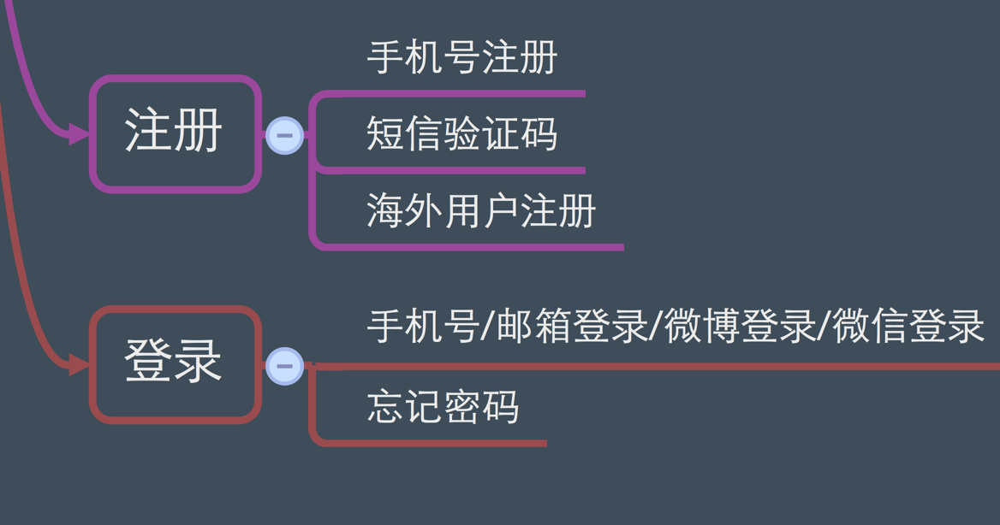
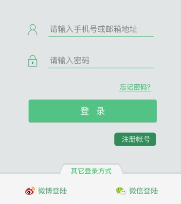
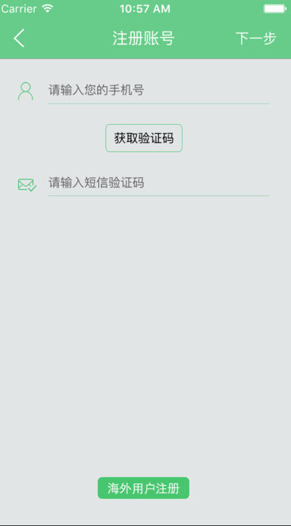
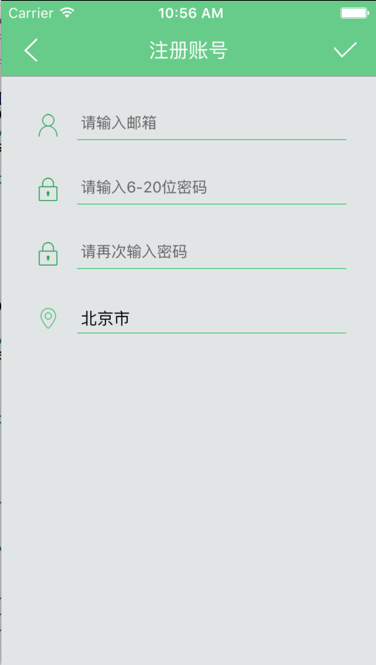
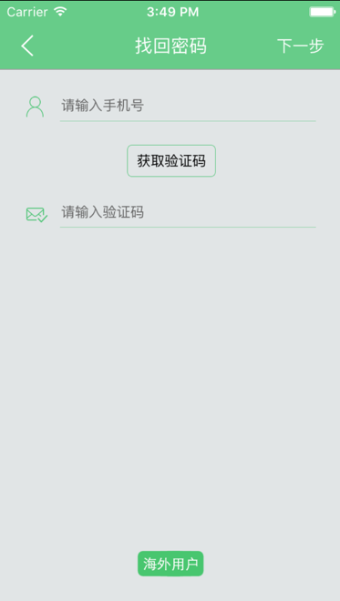

# 登录与注册模块

# 碰碰日程




# 登录模块

当用户第一次使用App并且查看完App新特性之后，用户进入登录页面```LoginViewController```即可登录，登录方式包含以下几种方式

| 1.手机号登录------->调用的方法：```loginEvent```|
| -- |
| 2.新浪微博登录------>调用的方法：```sinaLogin``` |
| 3.微信登录--------->调用的方法：```wechartLogin``` |


## 登录参数说明：

| ```phoneStr``` | **phoneStr**为登录用户的手机号 |
| -- | -- |
| ```passStr``` | **passStr**为登录用户的密码 |


### 登录方式效果图如下：



##手机号登录方式:

```swift
//使用手机号登录

-(void)loginEvent {
    NSString *phoneStr = ((CSTextField *)[self.view viewWithTag:1000]).text;
    NSString *passStr = ((CSTextField *)[self.view viewWithTag:1001]).text;
    
    //去掉字符串的空格

    NSString *nameStrTemp = [phoneStr stringByReplacingOccurrencesOfString:@" " withString:@""];
    NSString *passStrTemp = [passStr stringByReplacingOccurrencesOfString:@" " withString:@""];

    if ([nameStrTemp isEqualToString:@""]) {
        
        [SVProgressHUD showErrorWithStatus:@"用户名不能为空"];

    } else if([passStrTemp isEqualToString:@""]){
        
        [SVProgressHUD showErrorWithStatus:@"密码不能为空"];
        
    } else if (nameStrTemp.length != 11 && ![EmailValidate isValidateEmail:nameStrTemp]){
        
        [SVProgressHUD showErrorWithStatus:@"请输入正确的用户名"];

    } else {
        
        //防止重复点击登录按钮
        
        if (canTouch == NO) {
            return;
        }
        
        canTouch = NO;

        [SVProgressHUD showWithStatus:@"正在登录"];
        
        //开始发送登录网络请求
        
        [CCInterface requestLoginWithUser:phoneStr pass:passStr backBlock:^(int status, NSDictionary *dictResult) {
            canTouch = YES;
            if (status == 200) { //http的请求默认协议200 ,成功。

                if (dictResult == NULL) {
                    [SVProgressHUD showErrorWithStatus:@"登录失败，请稍后再试"];
                    return;
                }
                NSLog(@"登录 dictResult is %@",dictResult);

                if ([[dictResult objectForKey:@"status"] isEqualToString:statusSuccess]) {
                    [SVProgressHUD dismiss];
                    [self loginResult:dictResult];
                    [(CSTextField *)[self.view viewWithTag:1000] resignFirstResponder];
                    [(CSTextField *)[self.view viewWithTag:1001] resignFirstResponder];

                } else {
                    [SVProgressHUD showErrorWithStatus:[dictResult objectForKey:@"msg"]];
                }
            }
        }];
    }
}


```


# 注册模块

如果没有“碰碰日程”的账号，需要通过$$手机号注册$$一个账号，输入手机号并点击“获取验证码”，手机收到验证码并输入收到的验证码即可注册一个账号.海外注册需要通过$$邮箱注册$$就可以，无需手机号注册


## 参数说明


| ```phoneNum``` | **phoneNum**为注册用户的手机号 |
| -- | -- |
| ```Code``` | **Code**为用户收到的验证码 |
| ```timer``` | **timer**为定时器的时常，也是等代用户输入的时长 |


### 注册账号效果图：


1.手机号注册：


  


```swift

///  获取验证码点击事件

-(void)sendEvent {
    
    
    //获取手机号输入框对象
    
    CSTextField *tempText = nil;
    NSString *phoneNum = nil;
    tempText = (CSTextField *)[self.view viewWithTag:100];

    
    //去掉输入内容的空格
    
    NSString *nameStrTemp = [tempText.text stringByReplacingOccurrencesOfString:@" " withString:@""];
    
    //验证手机号格式
    
    if ([nameStrTemp isEqualToString:@""]) {
        [SVProgressHUD showErrorWithStatus:@"手机号不能为空"];
    } else if (nameStrTemp.length != 11) {
        [SVProgressHUD showErrorWithStatus:@"请输入正确的手机号"];
    } else {
        
        
        //手机格式输入正确之后的操作
        
        
        
        //按钮不能被重复点击
        if (canTouch == NO) {
            return;
        }
        //设置按钮点击状态
        canTouch = NO;
        [SVProgressHUD showWithStatus:@"正在验证您的手机号"];
        
        phoneNum = tempText.text;
        
        //将手机号进行二进制编码
        
        NSData *phoneData = [phoneNum dataUsingEncoding:NSASCIIStringEncoding];
        
        //将二进制数据进行base64
        phoneNum = [phoneData base64EncodedStringWithOptions:NSDataBase64EncodingEndLineWithLineFeed];
        
        NSLog(@"手机号📱encodeResult📱:%@",phoneNum);
        
        
        //发送需要注册的手机号
        
        [CCInterface requestVerifyCode:phoneNum backBlock:^(int status, NSDictionary *dictResult) {
            
            NSLog(@"当前线程是：🏠🏠🏠🏠🏠%@",[NSThread currentThread]);
            
            
            NSLog(@"dictResult is %@ %@",phoneNum, dictResult);
            
            //恢复按钮的”可“被点击的状态
            canTouch = YES;
            
            
            //判断网络状态码
            
            if (status == 200) {
                
                
                //出现异常
                
                NSLog(@"注册 验证码 dictresult：%@",dictResult);
                if (dictResult==NULL) {
                    [SVProgressHUD dismiss];
                    return ;
                }
                
                
                //输入完手机号后，进入的流程....
                
                
                if ([[dictResult objectForKey:@"status"] isEqualToString:statusSuccess]) {
                    
                    //保存返回的验证码
                    
                    code = [[[dictResult objectForKey:@"data"] objectForKey:@"code"] copy];
                    
                    //定时器秒数
                    
                    timers = 120;
                    
                    //设置定时器秒数变动按钮信息
                    
                    sendPassBtn.userInteractionEnabled = NO;
                    [sendPassBtn setTitle:[NSString stringWithFormat:@"%ld",(long)timers] forState:UIControlStateNormal];
                    [sendPassBtn setImage:[UIImage imageNamed:@""] forState:UIControlStateNormal];
                    
                    //将定时器放在当前线程,当前线程是主线程...   注意内存泄露问题
                    
                    [NSTimer scheduledTimerWithTimeInterval:1 target:self selector:@selector(startTimer:) userInfo:nil repeats:YES];
                    
                    //友好提醒
                    [SVProgressHUD showSuccessWithStatus:[dictResult objectForKey:@"msg"]];
                    
                } else {
                    
                    //友好提醒
                    [SVProgressHUD showErrorWithStatus:[dictResult objectForKey:@"msg"]];
                    
                }
            } else {
                
            }
        }];
        
    }
    
}


```


2.邮箱账号注册：



```swift
///  导航控制器右侧按钮点击事件

-(void)rightNavMenuEvent {
    
    
    //邮箱文本框
    
    NSString *mailStr = ((CSTextField *)[self.view viewWithTag:100]).text;
    
    //登录密码文本框
    
    NSString *passwordStr = ((CSTextField *)[self.view viewWithTag:101]).text;
    
    //确认密码文本框
    
    NSString *passwordStr2 = ((CSTextField *)[self.view viewWithTag:102]).text;

    
    //判断邮箱格式，密码是否合格
    
    if (![EmailValidate isValidateEmail:mailStr]) {
        [SVProgressHUD showErrorWithStatus:@"请输入正确的邮箱格式"];
    } else if (passwordStr.length<6 || passwordStr.length>20 ||passwordStr2.length<6 || passwordStr2.length>20) {
        [SVProgressHUD showErrorWithStatus:@"请输入6-20位密码"];
    } else if (![passwordStr isEqualToString:passwordStr2]) {
        [SVProgressHUD showErrorWithStatus:@"两次输入密码必须相同"];
    } else {
        
        //邮箱格式，密码都okay
        
        [SVProgressHUD showSuccessWithStatus:@"正在提交注册信息"];
        
        
        //发送”注册“网络请求
        
        [CCInterface requestRegistered:mailStr pass:passwordStr address:[LoginUserModel getCurrentLoginInfo].usermodel.user_vehicle key:nil openid:nil wtoken:nil sid:nil stoken:nil sname:nil form:@"mail" backBlock:^(int status, NSDictionary *dictResult) {

            NSLog(@"注册 result is %@",dictResult); //13910610155
            
            
            //网络无异常的特殊处理
            
            if (status == 200) {
                if (dictResult==NULL) {
                    [SVProgressHUD dismiss];
                    return ;
                }
                
            //注册信息没有任何问题
                
                if ([[dictResult objectForKey:@"status"] isEqualToString:statusSuccess]) {
                    [SVProgressHUD showSuccessWithStatus:[dictResult objectForKey:@"msg"]];
                   
                    for (int i=0; i<3; i++) {
                        CSTextField *tempText = (CSTextField *)[self.view viewWithTag:100];
                        [tempText resignFirstResponder];
                    }
                    
                    //退出注册控制器页面
                    
                    [self.navigationController dismissViewControllerAnimated:NO completion:nil];
                    
                    AppDelegate *dele = (AppDelegate *)[[UIApplication sharedApplication]delegate];
                    
                    //加载主界面所有的子视图
                    
                    [dele loadViewController:dictResult];
                    
                    //发送通知，用户的ID变化
                    
                    [[NSNotificationCenter defaultCenter] postNotificationName:UserIDChangeNoti object:nil];
                } else {
                    [SVProgressHUD showErrorWithStatus:[dictResult objectForKey:@"msg"]];
                }
            }
        }];
    }
}


```


---


# 忘记密码

当忘记注册账户的登录密码时，可通过注册手机号接收验证码，重新设置登录密码，重新设置之后可在```碰碰日程```重新登录此账户.


## 参数说明


| ```phoneNum``` | **phoneNum**为用户已经注册的手机号 |
| -- | -- |
| ```codeNum``` | **codeNum**为用户接收到的验证码 |


## 忘记密码页面效果图




```swift
///  获取验证码点击事件

-(void)sendEvent {
    
    //初始化手机号输入框
    
    CSTextField *tempText = (CSTextField *)[self.view viewWithTag:100];

    //去掉输入框内容中包含的空格
    
    NSString *nameStrTemp = [tempText.text stringByReplacingOccurrencesOfString:@" " withString:@""];
    
    //验证输入的手机号格式
    
    if ([nameStrTemp isEqualToString:@""]) {
        [SVProgressHUD showErrorWithStatus:@"手机号不能为空"];

    } else if (nameStrTemp.length != 11) {
        [SVProgressHUD showErrorWithStatus:@"请输入正确的手机号"];
    } else {
        
        if (canTouch == NO) {
            return;
        }
        
        //修改按钮被点击的状态
        
        canTouch = NO;
        
        [SVProgressHUD showWithStatus:@"正在验证您的手机号"];

        
        //获取所输入手机号
        
        NSString *phoneNum = tempText.text;
        
        //将所输入手机号进行二进制编码
        
        NSData *phoneData = [phoneNum dataUsingEncoding:NSASCIIStringEncoding];
        
        //将二进制编码进行Base64
        
        phoneNum = [phoneData base64EncodedStringWithOptions:NSDataBase64EncodingEndLineWithLineFeed];
        
        
        //将编码后的号码发送给后台
        
        [CCInterface requestFindPwCode:phoneNum backBlock:^(int status, NSDictionary *dictResult) {
            canTouch = YES;
            if (status == 200) {
                NSLog(@"找回密码 验证码 dictresult：%@",dictResult);
                if (dictResult==NULL) {
                    [SVProgressHUD dismiss];
                    return ;
                }
                
                
                //获取服务器返回的状态信息
                
                if ([[dictResult objectForKey:@"status"] isEqualToString:statusSuccess]) {
                    code = [[[dictResult objectForKey:@"data"] objectForKey:@"code"] copy];
                    
                    //设置定时器时长
                    
                    timers = 120;
                    
                    //设置显示时长的按钮

                    sendPassBtn.userInteractionEnabled = NO;
                    [sendPassBtn setTitle:[NSString stringWithFormat:@"%ld",(long)timers] forState:UIControlStateNormal];
                    [sendPassBtn setImage:[UIImage imageNamed:@""] forState:UIControlStateNormal];

                    [NSTimer scheduledTimerWithTimeInterval:1 target:self selector:@selector(startTimer:) userInfo:nil repeats:YES];
                    [SVProgressHUD showSuccessWithStatus:[dictResult objectForKey:@"msg"]];
                    
                } else {
                    [SVProgressHUD showErrorWithStatus:[dictResult objectForKey:@"msg"]];
                }
            } else {

            }
        }];
    }
}


///  右侧导航控制器的导航按钮

-(void)rightNavMenuEvent {

    //手机号
    
    NSString *phoneNum = ((CSTextField *)[self.view viewWithTag:100]).text;
    
    //验证码
    
    NSString *codeNum = ((CSTextField *)[self.view viewWithTag:101]).text;
    
    //除去手机号，验证码的空格

    NSString *phoneNum2 = [phoneNum stringByReplacingOccurrencesOfString:@" " withString:@""];
    NSString *codeNum2 = [codeNum stringByReplacingOccurrencesOfString:@" " withString:@""];


    //手机号与验证码信息验证
    
   if ([phoneNum2 isEqualToString:@""]||phoneNum2==nil) {

        [SVProgressHUD showErrorWithStatus:@"手机号不能为空"];

   } else if (phoneNum2.length!=11) {
       [SVProgressHUD showErrorWithStatus:@"请输入正确的手机号"];
   } else if ([codeNum2 isEqualToString:@""]||codeNum2==nil) {
        [SVProgressHUD showErrorWithStatus:@"验证码不能为空"];
    } else if (![code isEqualToString:codeNum2]) {
        [SVProgressHUD showErrorWithStatus:@"验证码错误"];
    } else {
        
        //创建ResetPassWordViewController控制器

        ResetPassWordViewController *resetPassVc = [[[ResetPassWordViewController alloc]init] autorelease];
        resetPassVc.codeStr = codeNum;
        resetPassVc.phoneStr = phoneNum;
        
        //设置导航控制器可左右移动
        
        [self SlideReturnEnable];
        
        //push重设密码控制器
        
        [self.navigationController pushViewController:resetPassVc animated:YES];
    }

}


```


## 重新设置新的密码


重设新的密码效果图：


