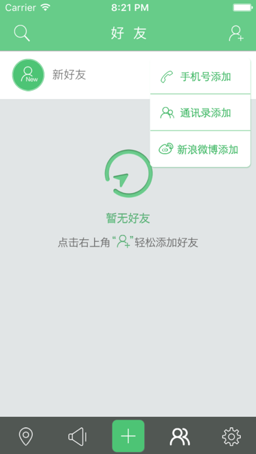
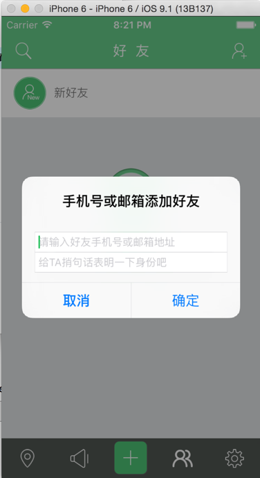
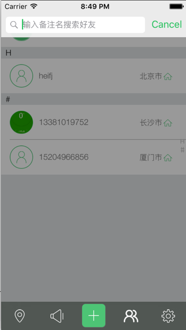

# 好友

此模块负责展示已添加好友，并查看是否有新的好友请求，当前用户可发送“添加好友”的请求，展示好友是按照A->Z排序分组展示，当好友特别多的时候可以使用搜索功能搜索你的好友.


好友列表效果图：


```swift

#pragma mark 把好友转为model

-(void)readLocationData:(NSArray *)myScheduleArr{
    
    
    //清空之前保存下来的”首字母“数组
    
    [sectionHeadsKeys removeAllObjects];
    [sectionHeadsKeys addObject:@""];
    
    //清空之前保存下来的好友数组
    
    [muArrFriends removeAllObjects];
    
    //    清空之前保存下来的排序后的数组
    
     [sortedArrForArrays removeAllObjects];
    
    //清空当前用户的user_friendsArr值
    
    [userModel.user_friendsArr removeAllObjects];
    
    NSLog(@"myarr is %ld",(unsigned long)myScheduleArr.count);
    
    
    
    //判断是否有好友
    
    if (myScheduleArr.count <=0 ) {
        
        if (!emptyImg) {
            emptyImg = [[[UIImageView alloc]initWithFrame:CGRectMake(0, 110, UIWidth, 145)] autorelease];
            emptyImg.image = [UIImage imageNamed:@"空状态－暂无好友"];
            emptyImg.hidden = YES;
            [myTableView addSubview:emptyImg];

            emptyImg.userInteractionEnabled = YES;
            UITapGestureRecognizer * tap = [UITapGestureRecognizer new];
            [tap addTarget:self action:@selector(handleTap)];
            [emptyImg addGestureRecognizer:tap];

        } else {
            
            emptyImg.hidden = NO;
            
        }
        
        
        //刷新myTableView的数据

        [myTableView reloadData];

        return;
        
    } else {
        
        //当有好友时，emptyImg为隐藏状态
        
        emptyImg.hidden = YES;
        
    }
    
    

    //循环遍历数据，将字典转换成UserModel模型
    
    for (int m=0; m<[myScheduleArr count]; m++) {
        NSDictionary *tempDict = [myScheduleArr objectAtIndex:m];
        UserModel *friModel = [[[UserModel alloc]init] autorelease];
        friModel.user_id = [tempDict objectForKey:@"friend_id"];
        if ([[tempDict objectForKey:@"remark"] isEqualToString:@""]||[tempDict objectForKey:@"remark"] == nil) {
            if ([[tempDict objectForKey:@"name"] isEqualToString:@""]||[tempDict objectForKey:@"name"]==nil) {
                friModel.user_name = [tempDict objectForKey:@"tel"];
            } else {
                friModel.user_name = [tempDict objectForKey:@"name"];
            }
        } else {
            friModel.user_name = [tempDict objectForKey:@"remark"];
        }
        friModel.user_remark = [tempDict objectForKey:@"remark"];
        friModel.user_nickName = [tempDict objectForKey:@"name"];
        friModel.user_phoneNum = [tempDict objectForKey:@"tel"];
        friModel.user_headImgUrl = [tempDict objectForKey:@"avatar_url"];
        friModel.user_homeCity = [tempDict objectForKey:@"address"];
        if ([[tempDict objectForKey:@"new_message"] intValue]>0) {
            friModel.user_isChanged = YES;
        }else {
            friModel.user_isChanged = NO;
        }
        friModel.user_relation = 4;
        [userModel.user_friendsArr addObject:friModel];
        
    }

    [muArrFriends addObjectsFromArray:userModel.user_friendsArr];
    muArrFriends = [SortObject sortArrayWithPinYin:muArrFriends];
    
    //将数组按照首字母A-Z进行排序
    
    [sortedArrForArrays addObjectsFromArray:[self getChineseStringArr:muArrFriends]];

    
    //  有数据时，tableView加载数据

    [myTableView reloadData];


}


```


添加好友效果图：




```swift

//点击添加好友，添加好友方式有"手机号添加","通讯录加班","微博添加"

-(void)addFriEvent:(UIButton *)temp {
    [self handleSingleTap];
    
    //通讯录添加
    if (temp.tag == 101) {
        TongxunluViewController *tongxunluVc = [[[TongxunluViewController alloc]init] autorelease];
        [self SlideReturnEnable];
        self.hidesBottomBarWhenPushed = YES;
        [self.navigationController pushViewController:tongxunluVc animated:YES];
        self.hidesBottomBarWhenPushed = NO;

    
    //新浪添加
    } else if (temp.tag == 102) {

        SinaViewController *sinaVc = [[[SinaViewController alloc]init]autorelease];
        [self SlideReturnEnable];
        self.hidesBottomBarWhenPushed = YES;
        [self.navigationController pushViewController:sinaVc animated:YES];
        self.hidesBottomBarWhenPushed = NO;
    //手机或邮箱添加
    } else if (temp.tag == 100){
        
        UIAlertView *myAlertView = [[UIAlertView alloc]initWithTitle:@"手机号或邮箱添加好友" message:@"" delegate:self cancelButtonTitle:@"取消" otherButtonTitles:@"确定", nil];
        myAlertView.tag = 501;
        [myAlertView layoutSubviews];
        myAlertView.alertViewStyle = UIAlertViewStyleLoginAndPasswordInput;
        myAlertView.delegate = self;
        
        [myAlertView textFieldAtIndex:0].placeholder = @"请输入好友手机号或邮箱地址";
        [myAlertView textFieldAtIndex:1].placeholder = @"给TA捎句话表明一下身份吧";
        [myAlertView textFieldAtIndex:1].secureTextEntry = NO;
        
        if (ISIOS7) {
            
            [[myAlertView textFieldAtIndex:0] setTintColor:Color_icon_green];
            [[myAlertView textFieldAtIndex:1] setTintColor:Color_icon_green];
            
        }
        
        [myAlertView show];
        [myAlertView release];

    }
}


```




```swift
///  点击添加好友中的其中一个方式
///
///  @param alertView   alerView对象
///  @param buttonIndex 你点击的button的索引

-(void)alertView:(UIAlertView *)alertView clickedButtonAtIndex:(NSInteger)buttonIndex {

    if (alertView.tag == 500) {
        
        //如果是通讯录添加，push到通讯录控制器
        
        if (buttonIndex == 1) {
            TongxunluViewController *tongxunluVc = [[[TongxunluViewController alloc]init] autorelease];
            [self SlideReturnEnable];
            self.hidesBottomBarWhenPushed = YES;
            [self.navigationController pushViewController:tongxunluVc animated:YES];
            self.hidesBottomBarWhenPushed = NO;
        }
        
    } else if (alertView.tag == 501) {
        
        if (buttonIndex == 1) {
            NSString *str = [alertView textFieldAtIndex:0].text;
            NSString *mesStr = [alertView textFieldAtIndex:1].text;
            
            //邮箱格式验证
            
            if (str.length != 11 && ![EmailValidate isValidateEmail:str]) {
                [SVProgressHUD showErrorWithStatus:@"请输入正确的手机号或邮箱地址"];
                return;
            }
            
            
            //邮箱格式正确后发送好友请求
            
            [CCInterface requestAddTel:str message:mesStr backBlock:^(int status, NSDictionary *dictResult) {
                NSLog(@"stri is %@",dictResult);
                
                if (status == 200) {
                    if ([[dictResult objectForKey:@"status"] isEqualToString:statusSuccess]) {
                        
                        //后台给的信息反馈，可能不存在此好友，或者添加好友成功
                        
                        [SVProgressHUD showSuccessWithStatus:[dictResult objectForKey:@"msg"]];
                    } else {
                        
                        //错误提示
                        
                        [SVProgressHUD showErrorWithStatus:[dictResult objectForKey:@"msg"]];
                    }
                }
            }];
            
            
            
            
        }

    }

}


```


搜索好友效果图：




```swift

///  点击导航控制器左侧的UIBarButtonItem触发搜索功能

-(void)leftNavMenuEvent {

    searchBar.hidden = NO;
    
    //让searchBar变成第一响应者
    [searchBar becomeFirstResponder];

}


```
