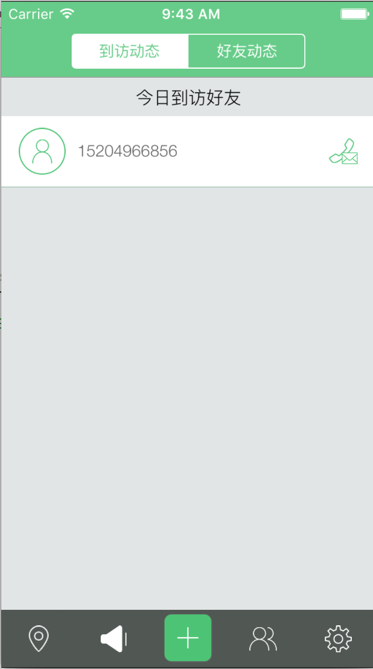
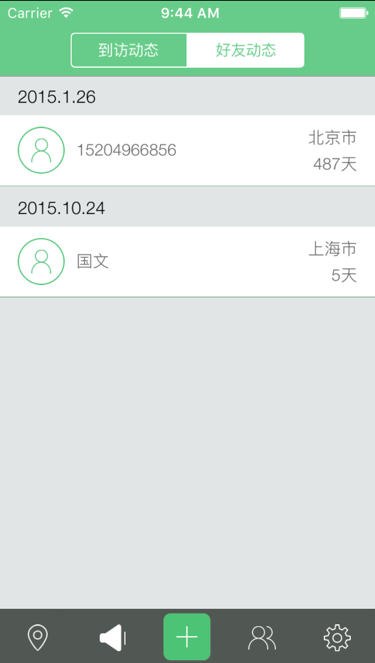

# 好友动态


## 好友动态结构图


####"好友动态"模块负责展示"当前用户"的好友到访"当前用户"所在城市的所有记录与好友最新的日程安排


到访动态效果图：





好友动态效果图:




```swift

- (void)viewDidLoad
{
    [super viewDidLoad];
    
    self.title = @"动态";

    NSArray *segArr = [[NSArray alloc]initWithObjects:@"到访动态",@"好友动态", nil];
    
    
    //默认状态，选中“到访动态”

    indexSeg = 0;
    
    //标记未请求好友动态
    
    tripRequest = NO;
    
    
    //创建UISegmentedControl 并添加到self.View中
    
    segmentedCon = [[UISegmentedControl alloc]initWithItems:segArr];
    segmentedCon.frame = CGRectMake(0, 7, 200, 30);
    segmentedCon.selectedSegmentIndex = indexSeg;
    
    if (ISIOS7) {
        segmentedCon.tintColor = [UIColor whiteColor];
    }
    
    segmentedCon.segmentedControlStyle = UISegmentedControlStylePlain;
    
    //设置监听选中事件监听方法
    
    [segmentedCon addTarget:self action:@selector(segMentEvent:) forControlEvents:UIControlEventValueChanged];
    
    //设置navigationItem的titleView为 segmentedCon

    self.navigationItem.titleView = segmentedCon;
    
    [segmentedCon release];
    
    [segArr release];


    //添加一个删除提醒的通知
    [[NSNotificationCenter defaultCenter] addObserver:self selector:@selector(getDataSource) name:DeleScheduleNoti object:nil];
    
    //监听系统通知
    [[NSNotificationCenter defaultCenter] addObserver:self selector:@selector(getDataSource) name:NotiComeFri object:nil];
    [[NSNotificationCenter defaultCenter] addObserver:self selector:@selector(getDataSource) name:NotiDeleFri object:nil];
    
    
    //初始化内容视图

    myTable = [[UITableView alloc]initWithFrame:CGRectMake(0, 0, UIWidth, UIHeight-UI_NavY-UI_Bar) style:UITableViewStyleGrouped];
    
    myTable.delegate = self;
    myTable.dataSource = self;
    
    myTable.backgroundColor = [UIColor clearColor];
    myTable.separatorColor = [UIColor clearColor];
    myTable.separatorStyle = UITableViewCellSeparatorStyleNone;
    myTable.tableFooterView = [[[UIView alloc] init] autorelease];
    if (ISIOS7) {
        myTable.sectionIndexBackgroundColor = [UIColor clearColor];
        myTable.sectionIndexTrackingBackgroundColor = [UIColor clearColor];
        self.edgesForExtendedLayout = UIRectEdgeNone;
    }

    [self.view addSubview:myTable];
    
    
    //初始化数据数组<到访动态数组，好友动态数组>


    scheduleComeArr = [[NSMutableArray alloc]init];
    scheduleDateArr = [[NSMutableArray alloc]init];
    
    
    //添加刷新控件

    if (_refreshHeaderView == nil) {

		EGORefreshTableHeaderView *view = [[EGORefreshTableHeaderView alloc] initWithFrame:CGRectMake(0.0f, -200.0f, myTable.frame.size.width, 200.0f)];
		view.delegate = self;
        view.backgroundColor = [UIColor clearColor];
		[myTable addSubview:view];
		_refreshHeaderView = view;
		[view release];

	}

    
    //加载数据
    [self locationMyCityData];
    
    //加载网络数据，并缓存到本地
    [self getMyCityData];
    
    
    //  给UITableView添加左右滑动手势
    
    UISwipeGestureRecognizer *swipeGesture=[[UISwipeGestureRecognizer alloc]initWithTarget:self action:@selector(rightNavMenuEvent)];
    swipeGesture.direction=UISwipeGestureRecognizerDirectionLeft;
    [myTable addGestureRecognizer:swipeGesture];
    [swipeGesture release];
    
    UISwipeGestureRecognizer *swipeGesture2=[[UISwipeGestureRecognizer alloc]initWithTarget:self action:@selector(leftNavMenuEvent)];
    swipeGesture2.direction=UISwipeGestureRecognizerDirectionRight;
    [myTable addGestureRecognizer:swipeGesture2];
    [swipeGesture2 release];
    
}


```


