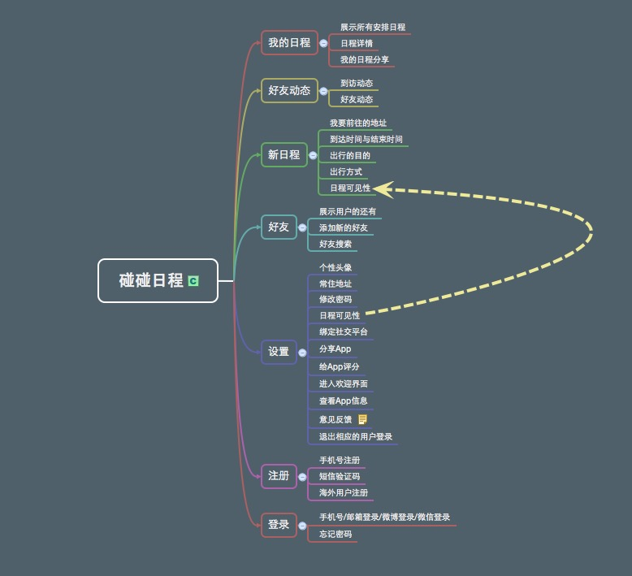

# 碰碰日程





# 登录模块

当用户第一次使用App并且查看完App新特性之后，用户进入登录页面```LoginViewController```即可登录，登录方式包含以下几种方式

| 1.手机号登录------->调用的方法：```loginEvent```|
| -- |
| 2.新浪微博登录------>调用的方法：```sinaLogin``` |
| 3.微信登录--------->调用的方法：```wechartLogin``` |


##手机号登录方式:

```swift
//使用手机号登录

-(void)loginEvent {
    NSString *phoneStr = ((CSTextField *)[self.view viewWithTag:1000]).text;
    NSString *passStr = ((CSTextField *)[self.view viewWithTag:1001]).text;
    
    //去掉字符串的空格

    NSString *nameStrTemp = [phoneStr stringByReplacingOccurrencesOfString:@" " withString:@""];
    NSString *passStrTemp = [passStr stringByReplacingOccurrencesOfString:@" " withString:@""];

    if ([nameStrTemp isEqualToString:@""]) {
        
        [SVProgressHUD showErrorWithStatus:@"用户名不能为空"];

    } else if([passStrTemp isEqualToString:@""]){
        
        [SVProgressHUD showErrorWithStatus:@"密码不能为空"];
        
    } else if (nameStrTemp.length != 11 && ![EmailValidate isValidateEmail:nameStrTemp]){
        
        [SVProgressHUD showErrorWithStatus:@"请输入正确的用户名"];

    } else {
        
        //防止重复点击登录按钮
        
        if (canTouch == NO) {
            return;
        }
        
        canTouch = NO;

        [SVProgressHUD showWithStatus:@"正在登录"];
        
        //开始发送登录网络请求
        
        [CCInterface requestLoginWithUser:phoneStr pass:passStr backBlock:^(int status, NSDictionary *dictResult) {
            canTouch = YES;
            if (status == 200) { //http的请求默认协议200 ,成功。

                if (dictResult == NULL) {
                    [SVProgressHUD showErrorWithStatus:@"登录失败，请稍后再试"];
                    return;
                }
                NSLog(@"登录 dictResult is %@",dictResult);

                if ([[dictResult objectForKey:@"status"] isEqualToString:statusSuccess]) {
                    [SVProgressHUD dismiss];
                    [self loginResult:dictResult];
                    [(CSTextField *)[self.view viewWithTag:1000] resignFirstResponder];
                    [(CSTextField *)[self.view viewWithTag:1001] resignFirstResponder];

                } else {
                    [SVProgressHUD showErrorWithStatus:[dictResult objectForKey:@"msg"]];
                }
            }
        }];
    }
}


```


# 注册模块

如果没有“碰碰日程”的账号，需要通过手机号注册一个账号，

