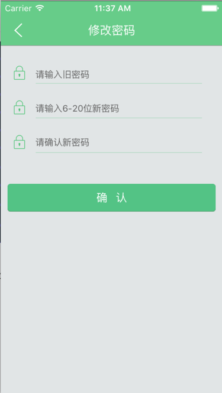

# 设置


"设置"可给当前用户设置“个性图像”，还可以“修改密码”，“App评分”，“意见反馈”，“退出登录”，此模块功能比较零散


```swift

-(void)ccActionSheet:(CCActiotSheet *)actionSheet clickedButtonAtIndex:(NSInteger)buttonIndex {
    if (actionSheet.tag == 888) {

        if (buttonIndex == 1) {
            [self shareWx:WXSceneTimeline];
        } else if (buttonIndex == 2) {
            [self shareWx:WXSceneSession];
        } else if (buttonIndex == 3) {

            [SVProgressHUD showWithStatus:@"正在分享"];
            [ShareClass mainRoot].share_type = SINA;
            
            [[NSUserDefaults standardUserDefaults]setObject:@"share" forKey:@"isShare"];
            [[NSUserDefaults standardUserDefaults]synchronize];

            //判断是否授权过期了。过期了，就去授权。
            if ([[NSUserDefaults standardUserDefaults]objectForKey:@"user_sinaToken"] == nil) {

                sinaBind = NO;
                [self sinaSSO];
                [myTable reloadData];
                return;
            } else {
                NSTimeInterval nowTime = [[NSDate date] timeIntervalSince1970];
                double authTime = [[[NSUserDefaults standardUserDefaults]objectForKey:@"authTime"] doubleValue]; //上次授权时间
                double tempTime = [[[NSUserDefaults standardUserDefaults] objectForKey:@"expires_in"] doubleValue]; //授权有效时间段

                NSLog(@"nowtime %f passtime %f passtime %f",nowTime,authTime,tempTime);
                if (authTime+tempTime<=nowTime) {
                    sinaBind = NO;
                    [self sinaSSO];
                    [myTable reloadData];
                    return;
                }
            }

            //下面是没有过期，直接分享。
            
            NSString *strText = [NSString stringWithFormat:@"#碰碰日程# 上一次见面是什么时候的事了？你在另一个城市过得还好么？我正在使用“碰碰日程”，共享出行日程，相聚并没有那么难！拉近我们的距离，你也下载一个吧！%@", QianXianUrl];
//            NSData *data = [NSData dataWithContentsOfFile:[[NSBundle mainBundle] pathForResource:@"111" ofType:@"png"]];
            NSData *data = UIImageJPEGRepresentation([UIImage  imageNamed:@"碰碰日程分享页"], 1.0);
            
            [CCInterface shareSinaWeiboWithAppkey:kAppKey access_token:[[NSUserDefaults standardUserDefaults] objectForKey:@"user_sinaToken"] text:strText image:data backBlock:^(int status, NSDictionary *dictResult) {
                if (status == 200) {

                    if ([dictResult objectForKey:@"error_code"] == nil) {

                        if ([dictResult objectForKey:@"id"]) {

                            [self showWait:@"分享成功"];
                            [self performSelector:@selector(hideWait) withObject:nil afterDelay:1.0];

                        }
                    }else{

                        //重复分享
                        if ([[dictResult objectForKey:@"error_code"] intValue] == 20111) {

                            [self showWait:@"重复分享 :("];
                            [self performSelector:@selector(hideWait) withObject:nil afterDelay:1.0];

                        }else if([[dictResult objectForKey:@"error_code"] intValue] == 21315 || [[dictResult objectForKey:@"error_code"] intValue] == 21316 ||[[dictResult objectForKey:@"error_code"] intValue] == 21317 ) {
                            sinaBind = NO;
                            [self sinaSSO];
                            [myTable reloadData];


                        }else{
                            //失败
                            [self showWait:@"分享失败 :("];
                            [self performSelector:@selector(hideWait) withObject:nil afterDelay:1.0];

                        }

                    }


                }else{
                    //失败
                    [self showWait:@"分享失败 :("];
                    [self performSelector:@selector(hideWait) withObject:nil afterDelay:1.0];
                    
                }
            }];
            

            
          
        }
        
    // actionSheet.tag = 1888 此选项为上传图片操作
    } else if (actionSheet.tag == 1888) {

        NSUInteger sourceType = 0;
        // 判断是否支持相机
        if([UIImagePickerController isSourceTypeAvailable:UIImagePickerControllerSourceTypeCamera]) {

            switch (buttonIndex) {
                case 1:
                    //访问相机
                    sourceType = UIImagePickerControllerSourceTypeCamera;
                    break;
                case 2:
                    //访问相册
                    sourceType = UIImagePickerControllerSourceTypePhotoLibrary;
                    break;
                case 0:
                    //不上传取消
                    return;
            }
            
        // 手机相册不可用
            
        }else {
            
            if (buttonIndex == 1 || buttonIndex == 2) {
                sourceType = UIImagePickerControllerSourceTypeSavedPhotosAlbum;
            } else {
                return;
            }
            
        }
        
        // 跳转到相机或相册页面
        
        // 初始化UIImagePickerController 访问手机相册
        
        UIImagePickerController *imagePickerController = [[UIImagePickerController alloc] init];

        imagePickerController.delegate = self;

        imagePickerController.allowsEditing = YES;
        
        //设置访问相机的类型

        imagePickerController.sourceType = sourceType;
        
        //modal出imagePickerController
        
        [self presentViewController:imagePickerController animated:YES completion:^{}];
        
        [imagePickerController release];
        
        //前期员工添加的...及其消耗性能

//        timer = [NSTimer timerWithTimeInterval:0.1 target:self selector:@selector(test) userInfo:self repeats:YES];
//        [[NSRunLoop currentRunLoop] addTimer:timer forMode:NSRunLoopCommonModes];
        
        
    // actionSheet.tag = 2888 代表是退出当前用户登录
        
    } else if (actionSheet.tag == 2888) {
        
        if (buttonIndex == 1) {
            
            
            //退出登录时，进入到登录界面

            AppDelegate *dele = (AppDelegate *)[[UIApplication sharedApplication]delegate];
            [dele userLogin];
            
            //当用户退出登录，发送UserIDChangeNoti通知
            [[NSNotificationCenter defaultCenter] postNotificationName:UserIDChangeNoti object:nil];
        }

    }

}


```

设置个性化图像：


```swift


```


修改密码：




意见反馈：


退出登录:


