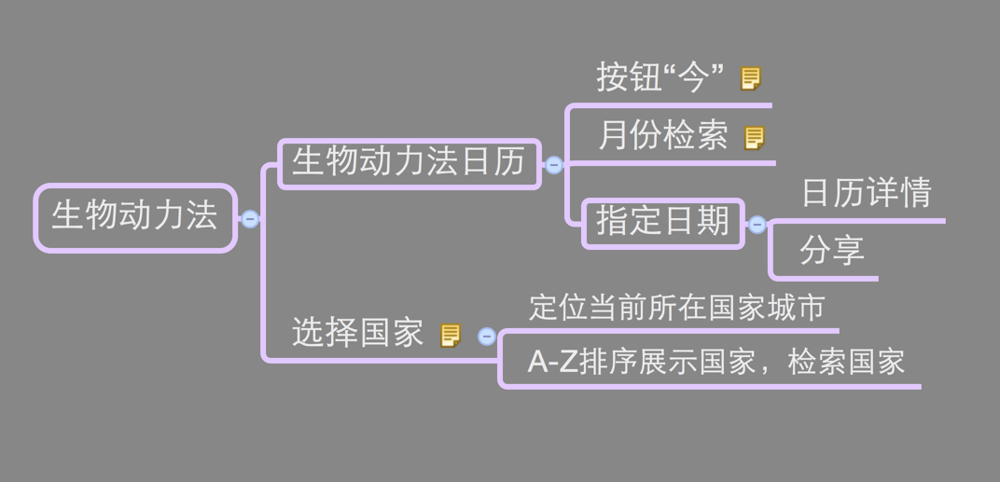
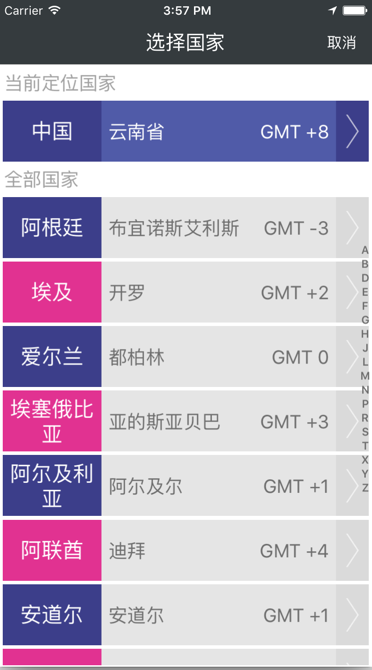
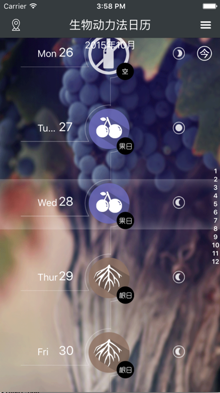

# 生物动力法


## 生物动力发架构图




"生物动力法"根据生物动力年历，把时间分为"花日"，"果日"，"根日"，"叶日","空日"五种情况，根据每天所对时间类型，看看今天是否适宜喝葡萄酒或者不宜饮酒，适合喝什么酒.


## 涉及文件名说明：

| ```CountryViewController``` | 此代表的是展示所有的国家视图控制器 |
| -- | -- |
| ```CountryTableViewCell``` | 此代表的是单个国家记录视图，是UITableView中的一个子控件 |
| ```CityModel``` | 此代表的是数据实体对象<城市实体> |


选择你想了解国家生物动力法：




```swift

//将读取出来的数据转换成model实体

-(void)dataToModel:(NSArray *)dataArr {
    
    
    //循环遍历转换model
    
    // country 表示所在国家   city 表示所在国家城市名  timeZone表示时差
    
    for (int i=0; i<dataArr.count; i++) {
        CityModel *_cityModel = [[CityModel alloc]init];
        _cityModel.CC_Name = [NSString stringWithFormat:@"%@%@",[dataArr[i] objectForKey:@"country"],[dataArr[i] objectForKey:@"city"]];
        _cityModel.country_Name = [dataArr[i] objectForKey:@"country"];
        _cityModel.city_Name = [dataArr[i] objectForKey:@"city"];
        _cityModel.location_Name = [dataArr[i] objectForKey:@"timeZone"];
        [cityModelArr addObject:_cityModel];
    }
    
    
    //将解析后的数组进行排序
    
    cityModelArr = [SortObject sortArrayWithPinYin:cityModelArr];
    [sortedArrForArrays addObjectsFromArray:[self getChineseStringArr:cityModelArr]];
}


-(UITableViewCell *)tableView:(UITableView *)tableView cellForRowAtIndexPath:(NSIndexPath *)indexPath {

    static NSString *cellIdentifier = @"cell";
    CountryTableViewCell *cell = [tableView dequeueReusableCellWithIdentifier:cellIdentifier];
    
    //当没有cell时，创建一个cell
    
    if (cell == nil) {
        cell = [[CountryTableViewCell alloc]initWithStyle:UITableViewCellStyleValue1 reuseIdentifier:cellIdentifier];
        [cell setSelectionStyle:UITableViewCellSelectionStyleNone];
    }
    
    
    //但是第一组时，展示此时用户所在的国家
    
    if (indexPath.section == 0) {
        cell.engNameLab.textColor = ProColorWhite;
        cell.locationLab.textColor = ProColorWhite;
        cell.backImg.image = [UIImage imageNamed:@"国家选择-定位"];
        cell.cityModel = locationCity;
    } else {
        
        
        //其他组的情况
        
        cell.engNameLab.textColor = ProColorGray;
        cell.locationLab.textColor = ProColorGray;
        
        //设置当前索引下的cityModel
        
        CityModel *tempModel = [[sortedArrForArrays objectAtIndex:indexPath.section-1] objectAtIndex:indexPath.row];
    

        cell.cityModel = tempModel;
        
        //按照奇偶，设置不同的背景图片
        
        if (indexPath.row%2==0) {
            cell.backImg.image = [UIImage imageNamed:@"国家选择-蓝"];
        } else {
            cell.backImg.image = [UIImage imageNamed:@"国家选择-粉"];
        }
        
    }
    
    return cell;
}


```





```swift


//控制器准备工作，创建个个组件

- (void)viewDidLoad {
    [super viewDidLoad];

    self.title = @"生物动力法日历";
    self.navigationItem.leftBarButtonItem = [self createLeftNavMainBtn:@"icon-定位" andTitle:nil];
    self.navigationItem.rightBarButtonItem = [self createRightNavMainBtn:@"icon-more" andTitle:nil];
    
    
    UIImageView *bgImgView = [[UIImageView alloc]initWithFrame:self.view.bounds];
    bgImgView.image = [UIImage imageNamed:@"详情-背景图-果"];
    [self.view addSubview:bgImgView];
    
    dele = (AppDelegate *)[[UIApplication sharedApplication]delegate];

    sectionHeadsKeys = [NSArray arrayWithObjects:@"1", @"2", @"3", @"4", @"5", @"6", @"7", @"8", @"9", @"10", @"11", @"12", nil];
    
    //添加UITableView之前，加载所有的日期数据，并保存下来
    
    [self getDataSource];
    
    //初始化内容视图，并将其当做内容视图
    
    myTable = [[UITableView alloc]initWithFrame:CGRectMake(0, 0, UIWidth, UIHeight-60) style:UITableViewStylePlain];
    myTable.sectionIndexColor = ProColorWhite;
    myTable.sectionIndexBackgroundColor = [UIColor clearColor];
    myTable.sectionIndexTrackingBackgroundColor = [UIColor clearColor];
    myTable.backgroundColor = [UIColor clearColor];
    myTable.delegate = self;
    myTable.dataSource = self;
    myTable.showsVerticalScrollIndicator = NO;
    myTable.separatorStyle = UITableViewCellSeparatorStyleNone;
    [self.view addSubview:myTable];
 

    // 点击分享时，添加一个遮罩视图
    
    zhezhaoView = [[UIView alloc]initWithFrame:CGRectMake(0, 0, UIWidth, UIHeight)];
    zhezhaoView.backgroundColor = [UIColor clearColor];
    zhezhaoView.userInteractionEnabled = NO;
    [self.view addSubview:zhezhaoView];
    UITapGestureRecognizer* singleRecognizer;
    singleRecognizer = [[UITapGestureRecognizer alloc] initWithTarget:self action:@selector(handleSingleTap)];
    singleRecognizer.numberOfTapsRequired = 1; // 单击
    [zhezhaoView addGestureRecognizer:singleRecognizer];
    

    // 点击导航栏右侧按钮，出现的视图
    
    popupImgView = [[UIImageView alloc]initWithFrame:CGRectMake(UIWidth-20*AutoSizeScale, 0, 0, 0)];
    popupImgView.userInteractionEnabled = YES;
    popupImgView.image = [UIImage imageNamed:@"好友_弹出底图"];
    popupImgView.alpha = 0.0;
    popupImgView.layer.masksToBounds = YES;
    [self.view addSubview:popupImgView];
    
    
    //popupImgView 添加三个选项
    
    for (int i=0; i<3; i++) {
        UIButton *myBtn = [UIButton buttonWithType:UIButtonTypeCustom];
        myBtn.frame = CGRectMake(2*AutoSizeScale, 13*AutoSizeScale+45*i*AutoSizeScale, 125*AutoSizeScale, 44*AutoSizeScale);
        if (i==0) {
            [myBtn setTitle:@"生物动力法简介" forState:UIControlStateNormal];
        } else if (i==1){
            [myBtn setTitle:@"根果花叶介绍" forState:UIControlStateNormal];
        } else if (i==2) {
            [myBtn setTitle:@"分享给好友" forState:UIControlStateNormal];
        }
        myBtn.titleLabel.font = [UIFont systemFontOfSize:14];
        [myBtn setTitleColor:[UIColor blackColor] forState:UIControlStateNormal];
        [myBtn addTarget:self action:@selector(buttonEvent:) forControlEvents:UIControlEventTouchUpInside];
        myBtn.tag = 100+i;
        [popupImgView addSubview:myBtn];
    }
    
    
    //向内容视图中添加一个todayBtn按钮
    
    UIButton *todayBtn = [UIButton buttonWithType:UIButtonTypeCustom];
    todayBtn.frame = CGRectMake(UIWidth-50*AutoSizeScale, 0*AutoSizeScale, 50*AutoSizeScale, 50*AutoSizeScale);
    
    [todayBtn setImage:[UIImage imageNamed:@"日历-今"] forState:UIControlStateNormal];
    [todayBtn addTarget:self action:@selector(setContentPoint) forControlEvents:UIControlEventTouchUpInside];
    [self.view addSubview:todayBtn];
    
    [self.view bringSubviewToFront:popupImgView];
    
    keyArr = [NSArray arrayWithObjects:@"01", @"02", @"03", @"04", @"05", @"06", @"07", @"08", @"09", @"10", @"11", @"12", nil];

    [self setContentPoint];
}


```


```swift

///  加载网络数据，并解析数据成model实体...

-(void)getDataSource {
    
    //判断当前要展示的城市，并取出数据
    NSString *cityStr =  [[NSUserDefaults standardUserDefaults] objectForKey:@"cityName"];
    _myDict = [LocalData getDictFromFilePath:@"cityData"];
    
    if ([_myDict count]==0) {
        
        [CCInterface requestGetData:cityStr callBack:^(int status, NSDictionary *dictResult) {
            NSLog(@"dict is %@",dictResult);
            
            if (status == 200) {
                if ([[dictResult objectForKey:@"success"] integerValue] ==1) {
                    
                    [[NSUserDefaults standardUserDefaults] setObject:@"YES" forKey:@"DATA"];
                    
                    NSString *lastRiziName = nil;
                    
                    //存储新数据的字典
                    NSMutableDictionary *newDict = [NSMutableDictionary dictionary];
                    for (int i=0; i<keyArr.count; i++) {
                        //存储新月份数据的数组
                        NSMutableArray *newArr = [NSMutableArray array];
                        
                        //取出每一个月的数据
                        NSArray *sectionArr = [[dictResult objectForKey:@"data"] objectForKey:[keyArr objectAtIndex:i]];
                        //遍历每月的每一天
                        
                        for (int j=0; j<sectionArr.count; j++) {
                            //存储新数据每一天数据
                            NSMutableDictionary *newData = [NSMutableDictionary dictionary];
                            [newData setObject:[sectionArr[j] objectForKey:@"attr"] forKey:@"attr"];
                            [newData setObject:[sectionArr[j] objectForKey:@"time"] forKey:@"time"];
                            [newData setObject:[sectionArr[j] objectForKey:@"date"] forKey:@"date"];
                            [newData setObject:[sectionArr[j] objectForKey:@"moon"] forKey:@"moon"];
                            NSArray *typeArr = [[sectionArr[j] objectForKey:@"type"] componentsSeparatedByString:@"-"];
                            
                            NSMutableArray *newTypeArr = [NSMutableArray array];
                            for (int k=0; k<typeArr.count; k++) {
                                
                                lastRiziName = typeArr[k];
                                
                                [newTypeArr addObject:lastRiziName];

                            }
                            NSString *newTypeStr = nil;
                            for (int m=0; m<newTypeArr.count; m++) {
                                if (m!=0) {
                                    newTypeStr = [NSString stringWithFormat:@"%@-%@",newTypeStr,newTypeArr[m]];
                                } else {
                                    newTypeStr = newTypeArr[0];
                                }
                            }
                            
                            [newData setObject:newTypeStr forKey:@"type"];
                            
                            [newArr addObject:newData];
                            
                        }
                        
                        [newDict setObject:newArr forKey:keyArr[i]];
                    }
                    
                    //存储当前城市数据
                    [LocalData saveDictToFile:newDict path:@"cityData"];
                    //存储当前城市数据版本号
                    
                    _myDict = newDict;
                    

                    [SVProgressHUD showSuccessWithStatus:@"数据加载成功"];
                    
                } else  {
                    [SVProgressHUD showErrorWithStatus:@"数据加载失败):"];
                }
            } else {
                [SVProgressHUD showErrorWithStatus:@"数据加载失败):"];
            }
            
        }];
    }
    
    // 刷新UITableView的数据
    
    [myTable reloadData];
    
}


///  单个时间的cell
///
///  @param tableView 展示生物动力法日历视图
///  @param indexPath 当前cell的索引
///
///  @return 返回自定义的cell

-(UITableViewCell *)tableView:(UITableView *)tableView cellForRowAtIndexPath:(NSIndexPath *)indexPath {
    
    static NSString *cellIdentifier = @"cell";
    
    //创建单个日历的Cell
    
    CalendarTableViewCell *cell = [tableView dequeueReusableCellWithIdentifier:cellIdentifier];
    
    //判断是否有
    
    if (cell == nil) {
        cell = [[CalendarTableViewCell alloc]initWithStyle:UITableViewCellStyleValue1 reuseIdentifier:cellIdentifier];
        [cell setSelectionStyle:UITableViewCellSelectionStyleNone];
        cell.backgroundColor = [UIColor clearColor];
    }
    
    
//  拿到当前row对应月份所有”日“  keyArr 为 01，02，03，04 月份数组
    
    NSArray *sectionArr = [_myDict objectForKey:[keyArr objectAtIndex:indexPath.section]];
    
    
    
    
/*
 
 _myDict中单个选项的内容
 
 {
	attr = 空;
	time = 00:00,23:00;
	date = 2015-02-24;
	type = 空-根;
	moon = 下;
 }
 
 NSLog(@"都有什么信息%@",_myDict);
 
 
 
 */
    
    
/*
    
//    NSDictionary *lastRowDict = [NSDictionary dictionary];
//    
//    if (indexPath.row != 0) {
//        
//        //sectionArr 为当前月份中所有日的数组集合
//        
//        //获取
//        
//        lastRowDict = [sectionArr objectAtIndex:indexPath.row-1];
//    } else {
//        
//        //当indexPath.row = 0时
//        
//        if (indexPath.section!=0) {
//            lastRowDict = [[_myDict objectForKey:[keyArr objectAtIndex:indexPath.section-1]] lastObject];
//        }
//        
//    }
 
 */
    
    // 获取当前组对应row的数据
    
    NSDictionary *rowDict = [sectionArr objectAtIndex:indexPath.row];

    [cell setDataDict:rowDict];
    
    return cell;
}


```


