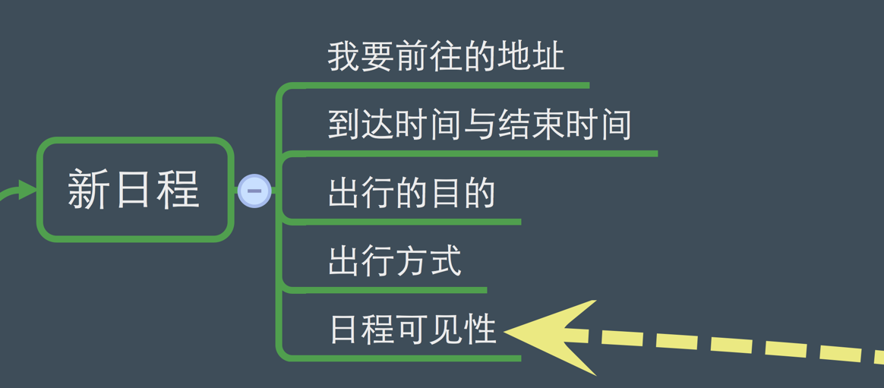
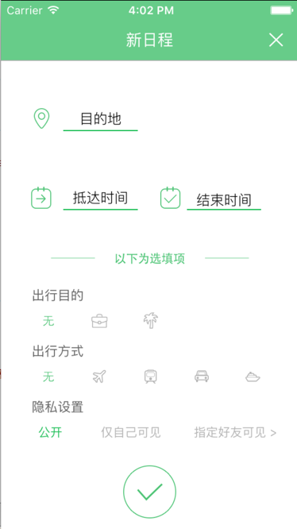

# 添加日程


## 添加日程结构图




"添加日程"模块可以为当前账号添加新的日程安排，日程安排中可以包含必选项与非必选项，必选项包含**目的地**，**到达时间**，**结束时间**，可选项中包含**出行方式**,**日程可见性**,**出行目的**.

| ```AddScheduleViewController``` | 此为“添加日程”控制器 |
| -- | -- |
| ```AddCityViewController``` | 此为在添加日程时，选择目的地一个视图控制器 |
| ```YinsiViewController``` | 设置 |
| ```CityCountyTable``` | 1:4 |


添加日程效果图：





```swift

- (void)viewDidLoad
{
    [super viewDidLoad];
    
	// Do any additional setup after loading the view.
    
    myDele = (AppDelegate *)[[UIApplication sharedApplication]delegate];

    newScheduleModel = [NewSchduleModel creatSchedule];
    newScheduleModel.schedule_days=1;

    self.title = @"新日程";
    
    self.view.backgroundColor = [UIColor whiteColor];
    self.navigationItem.rightBarButtonItem = [self createRightNavMainBtn:@"关闭按钮" andTitle:nil];

    //创建内容视图
    
    mySelfView = [[[UIScrollView alloc]initWithFrame:self.view.bounds] autorelease];
    mySelfView.backgroundColor = [UIColor clearColor];
    
    //设置内容视图的内容大小
    
    mySelfView.contentSize = CGSizeMake(UIWidth, 568);
    
    //设置内容视图有弹性效果
    
    mySelfView.bounces = YES;
    
    //设置内容视图的滚动条为隐藏状态
    mySelfView.showsHorizontalScrollIndicator = NO;
    mySelfView.showsVerticalScrollIndicator = NO;
    
    
    //将内容视图添加到控制器中
    
    [self.view addSubview:mySelfView];

    
    //此UIImageView为必选项，用来保存“目的地”，“抵达时间”，“结束时间”三个视图
    
    UIImageView *myImg = [[UIImageView alloc]initWithFrame:CGRectMake(0, 0, UIWidth, 180)];
    myImg.userInteractionEnabled = YES;
    myImg.backgroundColor = [UIColor whiteColor];
    
    
    [mySelfView addSubview:myImg];
    [myImg release];

    //主界面默认展示的
    
    for (int i = 0; i<3; i++) {

        UIImageView *iconImg = [[UIImageView alloc]init];
        [myImg addSubview:iconImg];
        [iconImg release];
        
        UIView *lineView = [[UIView alloc]init];
        lineView.backgroundColor = Color_icon_green;
        [myImg addSubview:lineView];
        [lineView release];
        
        UIButton *myButton = [UIButton buttonWithType:UIButtonTypeCustom];
        myButton.tag = 100+i;
        myButton.backgroundColor = [UIColor clearColor];
        myButton.titleLabel.textColor = ProColorWhite;
        myButton.titleLabel.font = [UIFont fontWithName:@"HelveticaNeue-Light" size:15];
        myButton.titleLabel.textAlignment = NSTextAlignmentLeft;
        [myButton setTitleColor:ProColorWhite forState:UIControlStateNormal];
        [myButton setTitleColor:ProColorGraySel forState:UIControlStateHighlighted];
        [myButton addTarget:self action:@selector(buttonEvent:) forControlEvents:UIControlEventTouchUpInside];
        [myImg addSubview:myButton];
        
        
        //i = 0时 添加 “目的地”图标与按钮，线条等
        
        if (i==0) {
            
            myButton.frame = CGRectMake(134/2, 50, 80, 25);
            lineView.frame = CGRectMake(134/2, 75, 80, 1);
            iconImg.frame = CGRectMake(31, 50, 25, 25);
            iconImg.image = [UIImage imageNamed:@"新建日程-地点"];
            
        //i = 1时 添加 “抵达时间”图标与按钮，线条等
            
        } else if (i==1) {
            myButton.frame = CGRectMake(134/2, 135, 80, 25);
            lineView.frame = CGRectMake(134/2, 160, 80, 1);
            iconImg.frame = CGRectMake(31, 135, 25, 25);
            iconImg.image = [UIImage imageNamed:@"新建日程-抵达"];
        
        //i = 0时 添加 “结束时间”图标与按钮，线条等
    
        } else {
            myButton.frame = CGRectMake(200, 135, 80, 30);
            lineView.frame = CGRectMake(200, 160, 80, 1);
            iconImg.frame = CGRectMake(170, 135, 25, 25);
            iconImg.image = [UIImage imageNamed:@"新建日程-结束"];
        }
        
    }
    
    
    //起到分割作用的UIImageView

    UIImageView *fengeImg = [[UIImageView alloc]initWithFrame:CGRectMake(0, 200, 320, 25)];
    fengeImg.image = [UIImage imageNamed:@"选填项分割"];
    [mySelfView addSubview:fengeImg];
    
    
    //可选项视图，此视图用来保存可选项“出行目的”，“出行方式”，“公开性”三个视图

    kexuanView = [[[UIView alloc]initWithFrame:CGRectMake(0, 235, UIWidth, 180)] autorelease];
    [mySelfView addSubview:kexuanView];
    [mySelfView sendSubviewToBack:kexuanView];
    kexuanView.alpha = 1.0;

    
    //三个可选项的背景
    
    for (int i=0; i<3; i++) {
        
        UIImageView *bgImg = [[UIImageView alloc]initWithFrame:CGRectMake(0, 5+60*i, UIWidth, 60)];
        bgImg.tag = 5000+i;
        bgImg.userInteractionEnabled = YES;
        [kexuanView addSubview:bgImg];
        
        UILabel *myLab = [[[UILabel alloc]initWithFrame:CGRectMake(31, 5, 60, 15)] autorelease];
        myLab.textAlignment = NSTextAlignmentCenter;
        myLab.textColor = ProColorGrayTow;
        myLab.backgroundColor = [UIColor clearColor];
        myLab.font = [UIFont systemFontOfSize:14];
        [bgImg addSubview:myLab];

        if (i==0) {
            myLab.text=@"出行目的";
        } else if (i==1) {
            myLab.text=@"出行方式";
        } else {
            myLab.text = @"隐私设置";
        }
        
        
    }

    lastBtnTag_purpose = 6000;
    lastBtnTag_traffic = 7000;
    lastBtnTag_privacy = 8000;
    newScheduleModel.schedule_vehicle = @"";
    newScheduleModel.schedule_yinsiType = 0;
    newScheduleModel.schedule_purpose = @"1";

    myArr_purpose = [[NSArray alloc]initWithObjects:@"无", @"商务", @"游玩", nil];
    myArr_traffic = [[NSArray alloc]initWithObjects:@"无", @"飞机", @"火车", @"汽车", @"轮船", nil];
    myArr_privacy = [[NSArray alloc]initWithObjects:@"公开", @"仅自己可见", @"指定好友可见 >", nil];


    UIImageView *bgImg1 = (UIImageView *)[kexuanView viewWithTag:5000];
    UIImageView *bgImg2 = (UIImageView *)[kexuanView viewWithTag:5001];
    UIImageView *bgImg3 = (UIImageView *)[kexuanView viewWithTag:5002];

    
    //出行目的选项
    
    for (int i=0; i<myArr_purpose.count; i++) {

        UIButton *myButton = [UIButton buttonWithType:UIButtonTypeCustom];
        myButton.frame = CGRectMake(31+55*i, 20, 40, 40);
        if (i==0) {
            [myButton setImage:[UIImage imageNamed:[myArr_purpose objectAtIndex:i]] forState:UIControlStateNormal];
        } else {
            [myButton setImage:[UIImage imageNamed:[NSString stringWithFormat:@"%@_未选中",[myArr_purpose objectAtIndex:i]]] forState:UIControlStateNormal];
        }
        myButton.tag = 6000+i;
        [myButton addTarget:self action:@selector(purposeEvent:) forControlEvents:UIControlEventTouchUpInside];
        [bgImg1 addSubview:myButton];
    }


    //出行方式选项
    for (int i=0; i<myArr_traffic.count; i++) {

        UIButton *myButton = [UIButton buttonWithType:UIButtonTypeCustom];
        myButton.frame = CGRectMake(31+55*i, 20, 40, 40);
        if (i==0) {
            [myButton setImage:[UIImage imageNamed:[myArr_traffic objectAtIndex:i]] forState:UIControlStateNormal];
        } else {
            [myButton setImage:[UIImage imageNamed:[NSString stringWithFormat:@"%@_未选中",[myArr_traffic objectAtIndex:i]]] forState:UIControlStateNormal];
        }
        myButton.tag = 7000+i;
        [myButton addTarget:self action:@selector(trafficEvent:) forControlEvents:UIControlEventTouchUpInside];
        [bgImg2 addSubview:myButton];
    }
    

    //隐私设置选项
    for (int j=0; j<3; j++) {
        UIButton *yinsiBtn = [UIButton buttonWithType:UIButtonTypeCustom];
        [yinsiBtn addTarget:self action:@selector(yinsiEvent:) forControlEvents:UIControlEventTouchUpInside];
        yinsiBtn.titleLabel.font = [UIFont systemFontOfSize:13];
        yinsiBtn.tag = 8000+j;
        [bgImg3 addSubview:yinsiBtn];

        [yinsiBtn setTitle:[myArr_privacy objectAtIndex:j] forState:UIControlStateNormal];
        if (j==0) {
            yinsiBtn.frame = CGRectMake(38, 20, 30, 40);
            [yinsiBtn setTitleColor:Color_icon_green forState:UIControlStateNormal];
        } else if(j==1) {
            yinsiBtn.frame = CGRectMake(105, 20, 70, 40);
            [yinsiBtn setTitleColor:RGB(180, 180, 180, 1) forState:UIControlStateNormal];

        } else {
            yinsiBtn.frame = CGRectMake(190, 20, 125, 40);
            [yinsiBtn setTitleColor:RGB(180, 180, 180, 1) forState:UIControlStateNormal];

        }
    }

    
    //添加一个添加日程完成按钮

    finishBtn = [UIButton buttonWithType:UIButtonTypeCustom];
    finishBtn.frame = CGRectMake(UIWidth/2-29, 435, 58, 58);
    [finishBtn setBackgroundColor:[UIColor clearColor]];
    [finishBtn setImage:[UIImage imageNamed:@"添加日程完成按钮"] forState:UIControlStateNormal];
    [finishBtn setImage:[UIImage imageNamed:@"添加日程完成按钮按下"] forState:UIControlStateHighlighted];
    [finishBtn addTarget:self action:@selector(finishEvent) forControlEvents:UIControlEventTouchUpInside];
    [mySelfView addSubview:finishBtn];

    UISwipeGestureRecognizer *swipeGesture=[[UISwipeGestureRecognizer alloc]initWithTarget:self action:@selector(rightNavMenuEvent)];
    swipeGesture.direction=UISwipeGestureRecognizerDirectionDown;
    [mySelfView addGestureRecognizer:swipeGesture];
    [swipeGesture release];

}


```


