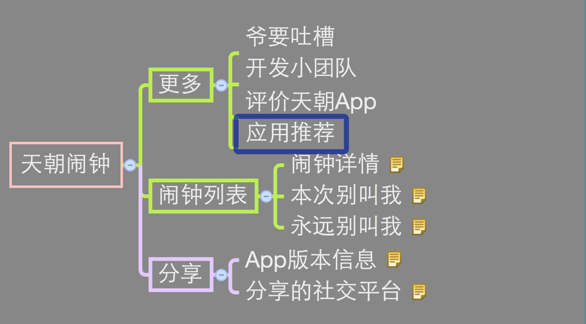
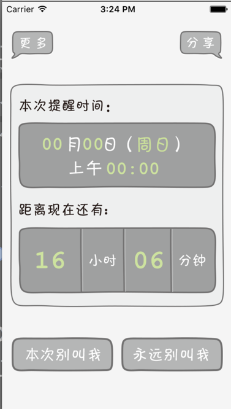
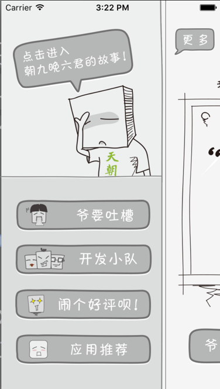
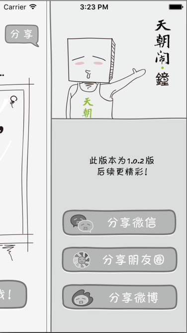

# 天朝闹钟

"天朝闹钟"是一款为上班人士定制的一款闹钟App,其界面为卡通元素，有幽默的特点，使用时可放松片刻.


| ```ViewController``` | 此为主要的视图控制器，其中包含子控件MainView视图<显示闹钟详情> |
| -- | -- |
| ```MoreView``` | 此为展示更多视图 |
| ```ApplicationViewController``` | 此为展示所需要推荐到App控制器 |


## 天朝闹钟架构图：




闹钟详情界面：





```swift
- (void)viewDidLoad
{
    [[UIApplication sharedApplication] setStatusBarHidden:NO];
    
    [super viewDidLoad];
    
    self.view.backgroundColor=[UIColor blackColor];
 
#pragma mark 设置闹钟界面显示动画
    
    /*
     CALayer默认使用正交投影，因此没有远小近大效果，而且没有明确的API可以使用透视投影矩阵
     加上下面3句代码就可以实现了。
     */
    
    
    //当点击“创建闹钟时”让主视图出现“远小进大”的效果
    
    CATransform3D scale = CATransform3DIdentity;
    scale.m34 = -1.0f/900;
    self.view.layer.sublayerTransform = scale;
    
    
#pragma mark 添加主页面
    
    //添加主视图
    [self addMainView];
    
    blackView = [[UIView alloc]initWithFrame:self.view.bounds];
    
//    blackView.backgroundColor = [UIColor redColor];
    
    //当点击“创建闹钟”时，在mainView的后面添加的背景视图，背景为黑色的
    
    blackView.backgroundColor = [UIColor blackColor];
    blackView.alpha = 0;
    [self.view addSubview:blackView];
    
    //z越大的话，离人眼的距离就大
    CATransform3D transform  = CATransform3DMakeTranslation(0, 0,100);
    blackView.layer.transform = transform;
    
#pragma mark 闹钟界面
    
    _setclockView = [[SetClockView alloc]init];
    if (UIHeight==480) {
        _setclockView.frame=CGRectMake(0, UIHeight, UIWidth, 388);
    }else {
        _setclockView.frame=CGRectMake(0, UIHeight, UIWidth, 440);
    }
    [self.view addSubview:_setclockView];
    
    [_setclockView release];
    
    //把_setclockView的距离放到最靠前，这样的话，遮罩view不会挡住。
    
    //设置缩放比例与透明度
    CATransform3D transform1 = CATransform3DMakeScale(0.89, 0.89, 1.0);
    
    //设置旋转地方向距离，100正合适，太大了按钮都被遮住
    CATransform3D transform2  = CATransform3DMakeTranslation(0, 0, 100);
    CATransform3D transform3 = CATransform3DConcat(transform1, transform2);
    _setclockView.layer.transform = transform3;
    
    
    //”设置闹钟“界面收回动画block，block中嵌套block   点击“工作日来闹我呗”《进入SetColockView》
    
    [_setclockView setSetclockBlock:^(SetClockEventType setClockType) {
        
        
        [UIView animateWithDuration:0.5 animations:^{
            if (UIHeight==480) {
                _setclockView.frame = CGRectMake(0, self.view.bounds.size.height, 320,388);
            }else {
                _setclockView.frame = CGRectMake(0, self.view.bounds.size.height, 320,440);
            }
        }];
        
        //动画，设置主界面收回动画block    《主界面用来显示已经创建好的闹钟》
        
        [UIView animateWithDuration:0.5 animations:^{
            
            
            //Translation和scale配合起来使用，才能达到远离肉眼的效果。
            CATransform3D transform  = CATransform3DMakeTranslation(0, 0,-10);
            
            CATransform3D transfromSclae = CATransform3DMakeScale(0.9, 0.9, 1);
            //创建一个动画组，添加2个3D效果。
            CATransform3D transformGroup = CATransform3DConcat(transform, transfromSclae);
            
            CATransform3D transformRote = CATransform3DRotate(transformGroup, M_PI/10, 1.0, 0, 0);
            
            _mainView.layer.transform = transformRote;

            blackView.alpha = 0.4;
            
        } completion:^(BOOL finished) {
            
            [UIView animateWithDuration:0.5 animations:^{
                
                
                //Translation和scale配合起来使用，才能达到远离肉眼的效果。
                CATransform3D transform  = CATransform3DMakeTranslation(0, 0,0);
                
                CATransform3D transfromSclae = CATransform3DMakeScale(1.0, 1.0, 1);
                //创建一个动画组，添加2个3D效果。
                CATransform3D transformGroup = CATransform3DConcat(transform, transfromSclae);
                
                _mainView.layer.transform = transformGroup;
                
                blackView.alpha = 0;
            }];
            
            
        }];
        _mainView.userInteractionEnabled = YES;

        //闹钟界面事件
        
        if (setClockType==0) {
            
            
            //当闹钟创建好后，进入主界面会被调用
            
        } else {
            
            
            //闹钟以创建好，展示创建好闹钟时间，”次提醒时间“，“距离现在还有”部分
            
            [_mainView.timeBackImg setImageName:@"btn_倒计时页面_倒计时背景.png"];
            
            //设置闹钟为被设置状态
            
            NSUserDefaults *userDefaults = [NSUserDefaults standardUserDefaults];
            [userDefaults setObject:@"set" forKey:@"isSetClock"];
            [[NSUserDefaults standardUserDefaults] synchronize];
            
            CATransition *myTransition=[CATransition animation];//创建CATransition
            myTransition.duration=0.8;//持续时长
            myTransition.timingFunction=UIViewAnimationCurveEaseInOut;//计时函数，从头到尾的流畅度
            myTransition.type=kCATransitionFade;//动画类型
            [_mainView.layer addAnimation:myTransition forKey:nil];
            _mainView.mainImageView.alpha=0.0;
            _mainView.setClockBtn.alpha=0.0;
            _mainView.cancelTomoBtn.alpha=1;
            _mainView.cancelForBtn.alpha=1;
            _mainView.hourLab.alpha=1;
            _mainView.minutesLab.alpha=1;
            _mainView.timeBackImg.alpha=1;
            
            NSMutableArray *muArrDate = [[NSMutableArray alloc] init];
            NSString *_strTime = [NSString stringWithFormat:@"%@:%@:00",_setclockView.hour,_setclockView.minite];
            
            //得到数据库的资源路径
            NSString *strDB = [[NSBundle mainBundle] pathForResource:@"time.db" ofType:nil];
            FMDatabase *database = [FMDatabase databaseWithPath:strDB];
            if ([database open]==NO) {
                NSLog(@"数据库打开失败!");
            }
            //这里是条件sql，也就是当前日期前一天。
            NSDate *dateSql = [timeToString dayPlus:1 date:[NSDate date]];
            NSLog(@"datesql is %@",dateSql);
            //查找大于当前日期的，64个日期。
            FMResultSet *set = [database executeQuery:@"select * from time where strdate > ? limit 64;",dateSql];
            
            //将数据库中读取出来的数据进行解析
            while ([set next]) {
                
                NSDateFormatter *dateFormatter = [[NSDateFormatter alloc]init];
                [dateFormatter setDateFormat:@"yyyy-MM-dd HH:mm:ss"];
                NSDate *date = [set dateForColumn:@"strdate"]; //数据库里取出的上班日期
                NSString *strDate = [timeToString returnYeanMonthDay:date];  //日期转为年与日的string
                NSString *strTime = [NSString stringWithFormat:@"%@ %@",strDate,_strTime];  //把string加上用户设置的闹钟时间
                NSDate *clockDate = [dateFormatter dateFromString:strTime];  //把时间字符串转为date类型
//                NSLog(@"date is %@",clockDate);
                
                NSDate *compareDate = [clockDate laterDate:[NSDate date]];
                
                if (compareDate == clockDate) {
                    [muArrDate addObject:clockDate];
                }
            
            }
            
            for (int i = 0; i<[muArrDate count]; i++) {
                
                if (i==0) {
                    NSDate *date = [muArrDate objectAtIndex:i];
                    [self addLocalNotation:date index:i];  //通知从0开始，如果想要取消哪个，就根据tag。
                }else {
                    
                    // 异步线程执行操作《创建本地通知》
                    
                    dispatch_async(dispatch_get_global_queue(DISPATCH_QUEUE_PRIORITY_DEFAULT, 0), ^{
                        NSDate *date = [muArrDate objectAtIndex:i];
                        [self addLocalNotation:date index:i];  //通知从0开始，如果想要取消哪个，就根据tag。
                    });
                }

            }


            
            if ([muArrDate count]>0) {
                
                
                //计算时间差
                
                nextDate = [muArrDate objectAtIndex:dayIndex];
                
                NSTimeInterval interval = -[[NSDate date] timeIntervalSinceDate:nextDate];
                
                // 小时
                
                int _hour = interval/3600;
                
                //分钟
                
                int _minute = (interval+59)/60;
                
                //秒钟
                
                _minute = _minute%60;
                
                
                //废弃之前的定时器
                
                if (myTimer) {
                    [myTimer invalidate];
                    myTimer=nil;
                }
                
                //创建新的定时器
                
                myTimer = [NSTimer scheduledTimerWithTimeInterval:1.0 target:self selector:@selector(changeTimer) userInfo:nil repeats:YES];
                
                
                //拼接时间格式
                
                NSString *hourStr = [NSString stringWithFormat:@"%d",_hour];
                if (_hour<10) {
                    hourStr = [NSString stringWithFormat:@"0%d",_hour];
                }
                NSString *minutesStr = [NSString stringWithFormat:@"%d",_minute];
                if (_minute<10) {
                    minutesStr = [NSString stringWithFormat:@"0%d",_minute];
                }
                
/*
                
//                NSUserDefaults *userDefaults = [NSUserDefaults standardUserDefaults];
//                [userDefaults setObject:nextDate forKey:@"notiTime"];
//                [userDefaults synchronize];
//                
//                NSString *dayStr = [timeToString returnYearMonthDayAndWeek : nextDate];
//                NSString *timeStr = [timeToString returnTime:nextDate];
//                NSArray *dateArr = [dayStr componentsSeparatedByString:@" "];
//                
//                _mainView.mouthLab.text = [dateArr objectAtIndex:0];
//                _mainView.dayLab.text = [dateArr objectAtIndex:1];
//                _mainView.weekDayImg.image = [UIImage imageNamed:[NSString stringWithFormat:@"bg_文字_%@.png",[dateArr objectAtIndex:2]]];
//                _mainView.timeLab.text = timeStr;
//                _mainView.hourLab.text=[NSString stringWithFormat:@"%@",hourStr];
//                _mainView.minutesLab.text = [NSString stringWithFormat:@"%@",minutesStr];
 
 */
                
            }
            
/*
            
            //当时第一次显示闹钟，并以设置了闹钟
            
//            if ([[userDefaults objectForKey:@"isSetClock"] isEqualToString:@"set"] && ![userDefaults objectForKey:@"FirstShow"] ){
//                [self performSelector:@selector(teachViewEvent) withObject:nil afterDelay:0.5];
//                [self tishiMuted];
//            }else {
//                [self beginDetection];
//            }
 
 */
            
        }
        
     }];
    
    
    //设置主界面所有的元素，调出更多、分享、设置闹钟 界面
    
    [_mainView SetBtnBlock:^(BtnEventType btnType) {
        
        //btnType = 0 时代表调用向右滑动的方法，调出左边的视图
        
        if (btnType==0) {
            [self leftShow];
            
        //btnType = 1 时代表调用向左滑动的方法，调出右边的视图
        } else if (btnType==1) {
            [self rightShow];
            
        //btnType = 2 时代表调出“设置闹钟界面”
        } else if (btnType==2){
            
            //动画开始出现，调出设置界面
            //0.8秒的时间，让conteview从底部移动到self可见区域。
            [UIView animateWithDuration:0.5 animations:^{
                //zhangyihui说，你得让他减340，之前是减240
                if (UIHeight==480) {
                    _setclockView.frame = CGRectMake(0, self.view.bounds.size.height-388, 320,388);
                }else {
                    _setclockView.frame = CGRectMake(0, self.view.bounds.size.height-440, 320,440);
                }
             _mainView.userInteractionEnabled = NO;
            }];
            
            [UIView animateWithDuration:0.3 animations:^{
                
                //默认先给底层视图，先根据x轴，旋转 M_PI/10角度
                CATransform3D transformRote = CATransform3DMakeRotation(M_PI/10, 1, 0, 0);
                _mainView.layer.transform = transformRote;
                blackView.alpha = 0.15;
                
            } completion:^(BOOL finished) {
                
                
                [UIView animateWithDuration:0.5 animations:^{
                    
                    
                    //Translation和scale配合起来使用，才能达到远离肉眼的效果。
                    CATransform3D transform  = CATransform3DMakeTranslation(0, 0,-100);
                    
                    CATransform3D transfromSclae = CATransform3DMakeScale(0.9, 0.9, 1);
                    //创建一个动画组，添加2个3D效果。
                    CATransform3D transformGroup = CATransform3DConcat(transform, transfromSclae);
                    
                    _mainView.layer.transform = transformGroup;
                    
                    
                    blackView.alpha = 0.4;
                    
                }];
            }];
            
         //btnType = 3 时  “本次别叫我”按钮点击事件
        } else if (btnType==3){
            
            
            //弹出推迟”闹钟提醒“界面，是否推迟
            
            
            //此视图上面添加多个”子元素视图“
            
            UIImageView *bgImageView = [[UIImageView alloc]initWithFrame:CGRectMake(0, UIHeight/2-142+UIY, 320, 284.5)];
            bgImageView.image = [UIImage imageNamed:@"bg_确认页面_按钮背景.png"];
            bgImageView.userInteractionEnabled=YES;

            //创建时间”显示文字“图片，代替文字
            
            UIImageView *zhouImg = [[UIImageView alloc]initWithFrame:CGRectMake(189, 122, 20, 22)];
            zhouImg.image = [UIImage imageNamed:@"bg_文字_周.png"];
            [bgImageView addSubview:zhouImg];
            UIImageView *weekDayImg = [[UIImageView alloc]initWithFrame:CGRectMake(212, 122, 20, 22)];
            weekDayImg.image = [UIImage imageNamed:@"bg_文字_周日.png"];
            [bgImageView addSubview:weekDayImg];
            
            
            //创建UILabel 显示具体数字，并设置字体颜色，字体样式
            
            
            //月份
            UILabel *mouthLab = [[UILabel alloc]initWithFrame:CGRectMake(56, 123, 30, 22)];
            mouthLab.backgroundColor=[UIColor clearColor];
            mouthLab.font = [UIFont fontWithName:@"CourierNewPS-BoldMT" size:24];
            mouthLab.textColor =[UIColor colorWithRed:205.0/255.0 green:226.0/255.0 blue:159.0/255.0 alpha:1];
            [mouthLab setTextAlignment:NSTextAlignmentRight];
            mouthLab.text = @"00";
            [bgImageView addSubview:mouthLab];
            [mouthLab release];
            
            //日
            UILabel *dayLab = [[UILabel alloc]initWithFrame:CGRectMake(110, 123, 30, 22)];
            dayLab.backgroundColor=[UIColor clearColor];
            dayLab.font = [UIFont fontWithName:@"CourierNewPS-BoldMT" size:24];
            dayLab.textColor =[UIColor colorWithRed:205.0/255.0 green:226.0/255.0 blue:159.0/255.0 alpha:1];
            [dayLab setTextAlignment:NSTextAlignmentCenter];
            dayLab.text = @"00";
            [bgImageView addSubview:dayLab];
            [dayLab release];
            
            //时间点《小时，分》
            UILabel *timeLab = [[UILabel alloc]initWithFrame:CGRectMake(143, 156, 80, 22)];
            timeLab.backgroundColor=[UIColor clearColor];
            timeLab.font = [UIFont fontWithName:@"CourierNewPS-BoldMT" size:24];
            timeLab.textColor =[UIColor colorWithRed:205.0/255.0 green:226.0/255.0 blue:159.0/255.0 alpha:1];
            [timeLab setTextAlignment:NSTextAlignmentCenter];
            timeLab.text = @"00:00";
            [bgImageView addSubview:timeLab];
            [timeLab release];
            
            
            UIApplication *app = [UIApplication sharedApplication];
            //获取本地推送数组
            NSArray *localArray = [app scheduledLocalNotifications];
            
            //获取下一次的提醒时间
            
            if ([localArray count]>0) {
                
                NSDate *nextDate2;
                UILocalNotification *notiToday = [localArray lastObject];
                NSDictionary *dictToday = notiToday.userInfo;
                NSString *strToday = [[dictToday objectForKey:@"key"] substringToIndex:10];
                if ([strToday isEqualToString:[timeToString returnYeanMonthDay:[NSDate new]]]) {
                    nextDate2 = [[timeToString stringToSpeDateAndTime:strToday] retain];
                } else {
                    UILocalNotification *notiNext = [localArray objectAtIndex:dayIndex+1];
                    
                    NSDictionary *dictNext = notiNext.userInfo;
                    NSString *strNext = [dictNext objectForKey:@"key"];
                    
                    nextDate2 = [[timeToString stringToSpeDateAndTime:strNext] retain];//得到下一次通知的时间
                }
                
                //截取时间段
                
                NSString *dayStr = [timeToString returnYearMonthDayAndWeek : nextDate2];
                NSString *timeStr = [timeToString returnTime:nextDate2];
                NSArray *dateArr = [dayStr componentsSeparatedByString:@" "];
                
                
                //设置具体周几图片
                
                weekDayImg.image = [UIImage imageNamed:[NSString stringWithFormat:@"bg_文字_%@.png",[dateArr objectAtIndex:2]]];
                
                //设置具体时间内容
                mouthLab.text = [dateArr objectAtIndex:0];
                dayLab.text = [dateArr objectAtIndex:1];
                timeLab.text = timeStr;
            }
            
            // 创建“确认”按钮
            
            UIButton *sureBtn = [UIButton buttonWithType:UIButtonTypeCustom];
            sureBtn.frame=CGRectMake(37, 214, 115, 46);
            [sureBtn setImage:[UIImage imageNamed:@"btn_确认页面_确定.png"] forState:UIControlStateNormal];
            [sureBtn setImage:[UIImage imageNamed:@"btn_确认页面_确定按下.png"] forState:UIControlStateHighlighted];
            [sureBtn addTarget:self action:@selector(sureEventTomo) forControlEvents:UIControlEventTouchUpInside];
            [bgImageView addSubview:sureBtn];
            
            
            //创建”取消“按钮

            UIButton *cancelBtn = [UIButton buttonWithType:UIButtonTypeCustom];
            cancelBtn.frame=CGRectMake(172, 214, 115, 46);
            [cancelBtn setImage:[UIImage imageNamed:@"btn_确认页面_点错.png"] forState:UIControlStateNormal];
            [cancelBtn setImage:[UIImage imageNamed:@"btn_确认页面_点错按下.png"] forState:UIControlStateHighlighted];
            [cancelBtn addTarget:self action:@selector(cancelEventTomo) forControlEvents:UIControlEventTouchUpInside];
            [bgImageView addSubview:cancelBtn];
            
            
            //创建CAlertView 提醒框
            
            alert = [[CAlertView alloc] initWithView:bgImageView];
            [bgImageView release];
            bgImageView = nil;
            [alert show];

            
        // btnType = 4 时表示创建第二个提醒框，此btn代表“永远别叫我”即为删除现在创建的闹钟
        } else if (btnType == 4) {
            
            
            //创建内容视图
            
            UIImageView *bgImageView = [[UIImageView alloc]initWithFrame:CGRectMake(0, UIHeight/2-63+UIY, 320, 185.5)];
            bgImageView.image = [UIImage imageNamed:@"bg_确认页面2_按钮背景.png"];
            bgImageView.userInteractionEnabled=YES;
            
            
            //创建“确认”按钮
            
            UIButton *sureBtn = [UIButton buttonWithType:UIButtonTypeCustom];
            sureBtn.frame=CGRectMake(37, 105, 115, 46);
            [sureBtn setImage:[UIImage imageNamed:@"btn_确认页面_确定.png"] forState:UIControlStateNormal];
            [sureBtn setImage:[UIImage imageNamed:@"btn_确认页面_确定按下.png"] forState:UIControlStateHighlighted];
            [sureBtn addTarget:self action:@selector(sureEventFor) forControlEvents:UIControlEventTouchUpInside];
            [bgImageView addSubview:sureBtn];
            
            
            //创建“取消”按钮
            
            UIButton *cancelBtn = [UIButton buttonWithType:UIButtonTypeCustom];
            cancelBtn.frame=CGRectMake(172, 105, 115, 46);
            [cancelBtn setImage:[UIImage imageNamed:@"btn_确认页面_点错.png"] forState:UIControlStateNormal];
            [cancelBtn setImage:[UIImage imageNamed:@"btn_确认页面_点错按下.png"] forState:UIControlStateHighlighted];
            [cancelBtn addTarget:self action:@selector(cancelEventFor) forControlEvents:UIControlEventTouchUpInside];
            [bgImageView addSubview:cancelBtn];
            
            
            //创建提示框视图
            
            alert2 = [[CAlertView alloc] initWithView:bgImageView];
            [bgImageView release];
            bgImageView = nil;
            [alert2 show];
            
            //btnType = 5时，往左滑动
        } else if (btnType==5){
            
            //左边是隐藏时
            
            if(leftHidden == NO){
                
                [self shareBackEvent];
                
            }else  if (rightHidden == YES) {
                
            //右边是
                [self rightShow];
            }

            //btnType = 6时，往右滑动
        }else if (btnType==6){
            
            //往右滑动

            if (rightHidden == NO){
                [self aboutBackEvent];
            }else if (leftHidden == YES) {
                [self leftShow];
            }

        }
        
    }];
    
    
    [self prefersStatusBarHidden];
    
    
    //保存闹钟设置状态
    
    NSUserDefaults *userDefaults = [NSUserDefaults standardUserDefaults];
    if (![[userDefaults objectForKey:@"isSetClock"] isEqualToString:@"set"] && ![userDefaults objectForKey:@"FirstSet"]) {
        [self teachViewEvent];
    } else if ([[userDefaults objectForKey:@"isSetClock"] isEqualToString:@"set"] && ![userDefaults objectForKey:@"FirstShow"] ){
        [self teachViewEvent];
    }
    
//    不起作用
    
//    statusView = [[StatusView alloc]initWithFrame:CGRectMake(0, UIY, 320, 30)];
//    [self.view addSubview:statusView];
//    
//    [statusView release];
//    statusView.alpha = 0;
    
    
}


```


向右边滑动：





```swift
//当向右滑动时调用此方法，展示左边的视图

-(void)leftShow {
    
    leftHidden =NO;
    
    NSUserDefaults *userDefaults = [NSUserDefaults standardUserDefaults];
    
    //判断是否是第一次进入”更多“界面
    if (![userDefaults objectForKey:@"FirstMore"]){
        [self performSelector:@selector(teachViewEvent) withObject:nil afterDelay:0.5];
    }
    
    //创建”更多“视图
    
    if (_moreView==nil) {
        _moreView = [[MoreView alloc]initWithFrame:CGRectMake(-320, 0, UIWidth, UIHeight)];
        typeof(self) bself = self;
        [_moreView moreBack:^{
            [bself aboutBackEvent];
        }];
        [self.view addSubview:_moreView];
        [_moreView release];
        
        double delayInSeconds = 0.1;
        
        //使用GCD延迟操作
        
        dispatch_time_t popTime = dispatch_time(DISPATCH_TIME_NOW, (int64_t)(delayInSeconds * NSEC_PER_SEC));
        
        //延迟操作，展示更多界面的内容
        
        dispatch_after(popTime, dispatch_get_main_queue(), ^(void){
            
            //以动画的形式展示
            
            [UIView animateWithDuration:0.3 animations:^{
                
                _moreView.frame=CGRectMake(-80, 0, UIWidth, UIHeight);
                _mainView.frame=CGRectMake(240, 0, UIWidth, UIHeight);
                
                if (aboutBackBtn==nil) {
                    
                    //创建返回按钮，按钮是透明的，只需tap一下就可以跳到”MainView“界面
                    
                    aboutBackBtn = [UIButton buttonWithType:UIButtonTypeCustom];
                    aboutBackBtn.frame=CGRectMake(240, UIY, 80, UIHeight);
                    aboutBackBtn.backgroundColor=[UIColor clearColor];
                    
                    [aboutBackBtn addTarget:self action:@selector(aboutBackEvent) forControlEvents:UIControlEventTouchUpInside];
                    [self.view addSubview:aboutBackBtn];
                    
                    //给此按钮添加一个向”左“的滑动手势，可以实现滑动返回到”MainView“
                    UISwipeGestureRecognizer *recognizer;
                    recognizer = [[UISwipeGestureRecognizer alloc]initWithTarget:self action:@selector(aboutBackEvent)];
                    [recognizer setDirection:(UISwipeGestureRecognizerDirectionLeft)];
                    [aboutBackBtn addGestureRecognizer:recognizer];
                    [recognizer release];
                    
                }else {
                    
                    //让aboutBackBtn显示
                    
                    aboutBackBtn.hidden=NO;
                }
            }];
            
            //改变aboutBackBtn的位置
            
            [self.view bringSubviewToFront:aboutBackBtn];
            
            if (leftLook) {
                [self.view bringSubviewToFront:[self.view viewWithTag:999]];
            }

        });
    }
    
    statusView.alpha = 1;
    [self.view bringSubviewToFront:statusView];

}


```


向左边滑动：



```swift


```

