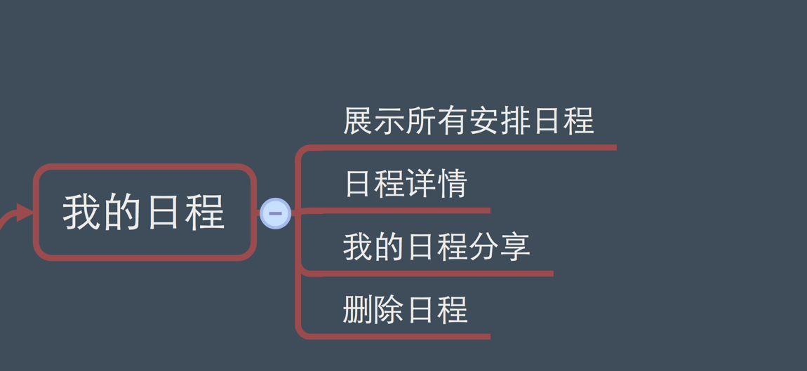

# 我的日程

## 我的日程结构图




我的日程```MySchViewController```展示当前用户的所有日程，包括**新日程**<未完成的日程>,**历史日程**,展示时按照时间排序<降序>.


| ```MySchViewController``` | 此为我的日程控制器，负责展示所有的日程记录 |
| -- | -- |
| ```SchDetailViewController``` | 此为展示单个日程记录详情的控制器 |
| ```ScheduleCell``` | 此为显示单个日程的cell |


我的日程效果图：


```swift
//展示我的日程准备工作

- (void)viewDidLoad
{
    [super viewDidLoad];

    self.title = @"我的日程";

    
    //我的日程分两部分，第一部分为“新日程”，第二部分为”历史日程“

    nowScheduleArr = [[NSMutableArray alloc]init];
    historyScheduleArr = [[NSMutableArray alloc]init];

    //获取当前用户的登录信息

    userModel = [LoginUserModel getCurrentLoginInfo].usermodel;
    
    userModel.user_scheduleArr = [[NSMutableArray alloc]init]; //按月分组后的数组
    
    userModel.user_scheduleHistoryArr = [[NSMutableArray alloc]init]; //历史日程
    
    
    //创建一个显示所有“我的日程”数据

    myTable = [[UITableView alloc]initWithFrame:CGRectMake(0, 0, UIWidth, UIHeight-UI_NavY-UI_Bar) style:UITableViewStyleGrouped];
    
    //myTable的分割线样式设为None
    
    myTable.separatorStyle = UITableViewCellSeparatorStyleNone;
    myTable.backgroundColor = [UIColor clearColor];
    
    //设置myTable的代理对象
    
    myTable.delegate = self;
    myTable.dataSource = self;
    
    //将myTable添加到MySchViewController视图控制器上
    
    [self.view addSubview:myTable];
    
    
    //设置“数字”通知角标
    
    if(ISIOS7)
    {
        self.edgesForExtendedLayout = UIRectEdgeNone;
    }
    
    //懒加载刷新控件

	if (_refreshHeaderView == nil) {

		EGORefreshTableHeaderView *view = [[EGORefreshTableHeaderView alloc] initWithFrame:CGRectMake(0.0f, -200.0f, myTable.frame.size.width, 200.0f)];
        
        //设置EGORefreshTableHeaderView的代理对象
        
		view.delegate = self;
        view.backgroundColor = [UIColor clearColor];
        
        //将EGORefreshTableHeaderView添加到tableView上
        
		[myTable addSubview:view];
		_refreshHeaderView = view;
		[view release];

	}
    
    //加载所有的日程数据

    [self getDataSource];


    //注册一个监听添加日程的通知（添加日程后，当前界面要重新获取数据并刷新）
    [[NSNotificationCenter defaultCenter] addObserver:self selector:@selector(addNewSchedule:) name:AddScheduleNoti object:nil];

    //添加一个删除提醒的通知
    [[NSNotificationCenter defaultCenter] addObserver:self selector:@selector(getDataSource) name:DeleScheduleNoti object:nil];

    //监听“我的来访通知”系统通知-----已作废
    [[NSNotificationCenter defaultCenter] addObserver:self selector:@selector(backToSelf) name:NotiComeFri object:nil];
    
    //监听点击单个记录的通知
    
    [[NSNotificationCenter defaultCenter] addObserver:self selector:@selector(gotoSchDetail:) name:NOtiOneSchedule object:nil];
    
    //设置tableView的footerView

    footView = [[LoadMoreView alloc]initWithFrame:CGRectMake(0, 0, UIWidth, 40)];
    footView.backgroundColor = [UIColor clearColor];
    footView.hidden = YES;
    myTable.tableFooterView = footView;

}


```

加载数据日程数据：
此处加载当前用户所有的日程数据，将服务器返回的数据进行字典转模型，转换完成后刷新数据


参数说明：

```swift

#pragma mark 把日程转为model  ❤️<字典转模型>❤️

-(void)readLocationData:(NSDictionary *)myScheduleDict{
    
    //在之前将所有保存的数据清空
    
    [userModel.user_scheduleArr removeAllObjects];
    [userModel.user_scheduleHistoryArr removeAllObjects];
    
    //获取新日程与历史日程数据
    
    [nowScheduleArr addObjectsFromArray:[myScheduleDict objectForKey:@"now"]];
    
    [historyScheduleArr addObjectsFromArray: [myScheduleDict objectForKey:@"history"]];
    
    //数据为空时
    
    if (nowScheduleArr.count <=0 && historyScheduleArr.count<=0) {
        
        if (!emptyImg) {
            emptyImg = [[[UIImageView alloc]initWithFrame:CGRectMake(0, 110, UIWidth, 145)] autorelease];
            emptyImg.image = [UIImage imageNamed:@"空状态－暂无日程"];
            [myTable addSubview:emptyImg];
            emptyImg.userInteractionEnabled = YES;
            UITapGestureRecognizer * tap = [UITapGestureRecognizer new];
            [tap addTarget:self action:@selector(handleTap)];
            [emptyImg addGestureRecognizer:tap];
            
        } else {
            
            //当数据为空时，图片为显示状态
            
            emptyImg.hidden = NO;
            
        }
        
        //刷新数据，当删除日程后，没有一个记录时也需要更新数据
        
        [myTable reloadData];
        
        return;
        
    } else {
        
        //当有数据时隐藏图片
        
        emptyImg.hidden = YES;
        
    }
    
    //❤️我的日程列表❤️
    
    NSMutableArray *tempArr = [[[NSMutableArray alloc]init]autorelease];
    
    NSMutableArray *getTempSchArr = [[[NSMutableArray alloc]init] autorelease];
    
    for (int i=0; i<2; i++) {
        
        //移除所有的历史数据
        
        [tempArr removeAllObjects];
        [getTempSchArr removeAllObjects];
        
        if (i==0) {
            
            //添加新的日程
            [tempArr addObjectsFromArray:nowScheduleArr];
        } else {
            
            //添加历史的日程
            [tempArr addObjectsFromArray:historyScheduleArr];
        }
        
        
        if (tempArr.count <= 0) {
            continue;
        }
        
        
        //循环遍历字典，将字典转换成模型
        
        for (int k=0; k<tempArr.count; k++) {
            
            //获取tempArr数组中第k个字典
            
            NSDictionary *tempDict = [tempArr objectAtIndex:k];
            
            //进行非空判断，防止字典中保存了nil对象，出现Crash现象
            
            if ([tempDict isKindOfClass:[NSNull class]]) {
                continue;
            }
            
            //获取日程开始时间，并将其转换成NSDate
            
            NSDate *schDate = [timeToString stringToDate:[tempDict objectForKey:@"date_start"]];
            
            //获取日程结束时间，并将其转换成NSDate
            
            NSDate *schEndDate = [timeToString stringToDate:[tempDict objectForKey:@"date_end"]];
            
            
            //创建日程模型对象
            
            ScheduleModel *scheduleModel = [[[ScheduleModel alloc]init] autorelease];
            
            //date_start 为日程开始时间
            scheduleModel.schedule_date = [tempDict objectForKey:@"date_start"];
            
            //vehicle  为日程交通方式
            scheduleModel.schedule_vehicle = [tempDict objectForKey:@"vehicle"];
            
            //purpose  为日程的目的<旅行，商务...>
            scheduleModel.schedule_purpose = [tempDict objectForKey:@"purpose"];
            
            //截取字符串时间的 年，月，日部分   timeToString为一个工具类
            
            scheduleModel.schedule_date_year = [timeToString returnYear:schDate];
            scheduleModel.schedule_date_month = [timeToString returnMonth:schDate];
            scheduleModel.schedule_date_day = [timeToString returnDay:schDate];
            
            //address  为日程的目的地
            scheduleModel.schedule_city = [tempDict objectForKey:@"address"];
            
            //date_length 为日程安排的时间长度
            scheduleModel.schedule_days = [[tempDict objectForKey:@"date_length"] intValue];
            
            //date_end 为日程的结束时间
            scheduleModel.schedule_endDate = [tempDict objectForKey:@"date_end"];
            
            //截取字符串时间的 年，月，日部分
            
            scheduleModel.schedule_endDate_year = [timeToString returnYear:schEndDate];
            scheduleModel.schedule_endDate_month = [timeToString returnMonth:schEndDate];
            scheduleModel.schedule_endDate_day = [timeToString returnDay:schEndDate];
            
            //schedule_id为日程的ID号
            
            scheduleModel.schedule_ID = [tempDict objectForKey:@"schedule_id"];
            
            //relationships  为当前日程碰到的朋友数
            
            scheduleModel.schedule_friCount = [[tempDict objectForKey:@"relationships"] intValue];
            
            //创建好友对象数组，显示详情中需要使用到
            
            scheduleModel.schedule_friendsArr = [[[NSMutableArray alloc]init] autorelease];
            
            //policy 为日程的 隐藏策略
            scheduleModel.schedule_yinsiType = [tempDict objectForKey:@"policy"];
            
            //fids 为日程的可见好友的详情数组
            
            scheduleModel.schedule_yinsiFriArr = [tempDict objectForKey:@"fids"];
            
            
            if (i==1) {
                
                //标记模型为历史日程
                
                scheduleModel.schedule_isPass = YES;
                
            }
            
            
            NSArray *pengFriArr = [[[NSArray alloc]init]autorelease];
            
            //日程中碰到的朋友
            
            pengFriArr = [tempDict objectForKey:@"relations"];
            
            //日程中碰到的朋友数量
            
            scheduleModel.schedule_friCount = pengFriArr.count;
            
            
            for (int j=0; j<[pengFriArr count]; j++) {
                
                NSDictionary *friDict = [pengFriArr objectAtIndex:j];
                
                
                //非空判断，防止字典中保存nil对象时出现crash现象
                
                if ([friDict isKindOfClass:[NSNull class]]) {
                    continue;
                }
                
                //创建当个好友对象。。。此好友数组为此日程关联的
                
                UserModel *friModel = [[[UserModel alloc]init] autorelease];
                
                //用户的id
                friModel.user_id = [friDict objectForKey:@"uid"];
                
                
                //remark 为好友备注备注    当”备注“为空时，用户名为name值或者为utel值
                
                if ([[friDict objectForKey:@"remark"] isEqualToString:@""]||[friDict objectForKey:@"remark"]==nil) {
                    
                    //name 为好友名
                    if ([[friDict objectForKey:@"name"] isEqualToString:@""]||[friDict objectForKey:@"name"]==nil) {
                        
                        //utel 为好友的手机号
                        friModel.user_name = [friDict objectForKey:@"utel"];
                    } else {
                        friModel.user_name = [friDict objectForKey:@"name"];
                    }
                    
                } else {
                    
                    //当remark 不为空时，用户名为备注
                    
                    friModel.user_name = [friDict objectForKey:@"remark"];
                }
                
                //给用户模型设置参数值
                
                
                //remark 为备注
                
                friModel.user_remark = [friDict objectForKey:@"remark"];
                
                //name 为用户名  设置用户的别名
                
                friModel.user_nickName = [friDict objectForKey:@"name"];
                
                //设置用户的手机号
                
                friModel.user_phoneNum = [friDict objectForKey:@"utel"];
                
                //avatar_url 为用户的头像的地址
                
                friModel.user_headImgUrl = [friDict objectForKey:@"avatar_url"];
                
                //将好友对象添加到日程模型中
                
                [scheduleModel.schedule_friendsArr addObject:friModel];
            }
            
            [getTempSchArr addObject:scheduleModel];
            
        }
        
        //将日程数组进行”分组“
        
        [self schMonthArr:getTempSchArr type:(int)i];
        
    }
    
    
    //当次日程的“新日程”数与“历史日程”数小于1时，隐藏footerView
    
    if (nowScheduleArr.count+historyScheduleArr.count < 1) {
        footView.hidden = YES;
    } else {
        
        //此处证明有至少"一页"的数据
        
        footView.hidden = NO;
        
        if (pageCount==1) {
            
            //当pageCount为1时，无需刷新数据，footerView提示为“以上为全部日程”
            
            [footView changeLoadingStatus:NO isMore:NO];
        } else {
            
            //当pageCount大于1时，footerView提示“上拉加载数据”
            
            [footView changeLoadingStatus:NO isMore:YES];
        }
        
    }
    
    //   😄😄😄😄😄 开始加载tableView的数据  😄😄😄😄😄😄😄😄
    
    [myTable reloadData];
    
}


```


## 展示单个日程详情：


效果图：


```swift

////  选中其中一个“日程记录”时，跳转到详情页
///
///  @param tableView 展示数据对象tableView
///  @param indexPath 当个记录的索引

-(void)tableView:(UITableView *)tableView didSelectRowAtIndexPath:(NSIndexPath *)indexPath {

    NSInteger tempSection = indexPath.section - userModel.user_scheduleArr.count;

    SchDetailViewController *schDetailVc = [[SchDetailViewController alloc]init];
    
    //设置进入日程详情页的类型，代表是从我的日程进入
    schDetailVc.schDetail_type = MySchedulesType;
    
    
    //有”历史日程“与“新日程”是分开的，所以在获取数据时需要判断
    
    
    //user_scheduleArr的数字为1
    
//    NSLog(@"🐶🐶🐶🐶🐶🐶🐶user_scheduleArr数组%ld",userModel.user_scheduleArr.count);
    
    if (indexPath.section < userModel.user_scheduleArr.count) {
        
        //第一组为“新日程"
        
        schDetailVc.scheduleModel = [[userModel.user_scheduleArr objectAtIndex:indexPath.section] objectAtIndex:indexPath.row];
        
    } else {
        
        //第二组为"历史日程"
        
        schDetailVc.scheduleModel = [[userModel.user_scheduleHistoryArr objectAtIndex:tempSection] objectAtIndex:indexPath.row];
        
    }
    
    NSInteger messageCount = schDetailVc.scheduleModel.schedule_friCount;
    
    //当messageCount>0时需要刷新数据
    
    if (messageCount>0) {
        
        isLoadData = YES;
        
    }
    
    
    //设置可以左右滑动
    [self SlideReturnEnable];
    
    //当跳转到详情页时，隐藏tabBarBottomItem
    self.hidesBottomBarWhenPushed = YES;
    
    //调转到详情页
    [self.navigationController pushViewController:schDetailVc animated:YES];
    
    //跳转回来不会隐藏tabBarButtonItem
    self.hidesBottomBarWhenPushed = NO;
    [schDetailVc release];
    
}


```


